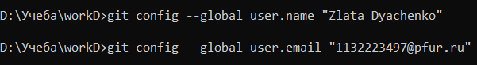
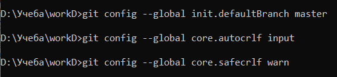
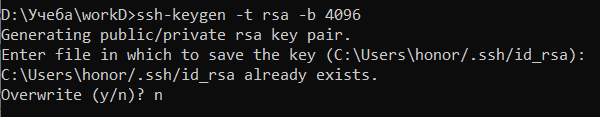
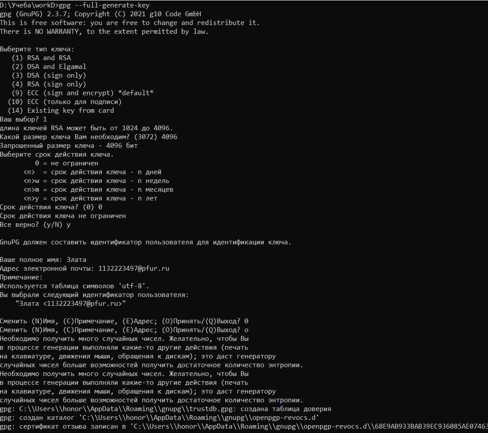
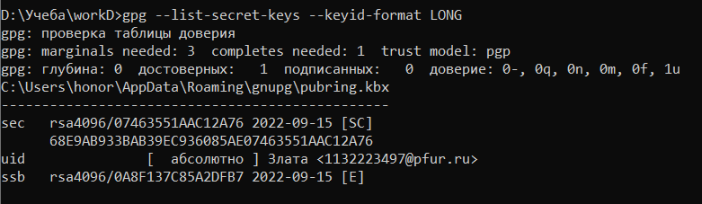
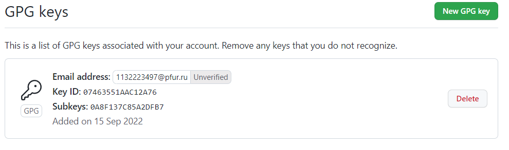
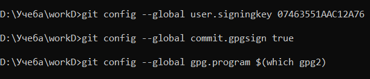
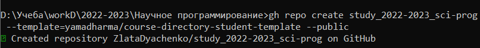
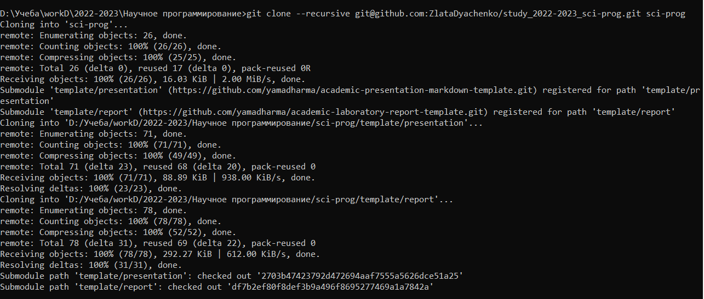
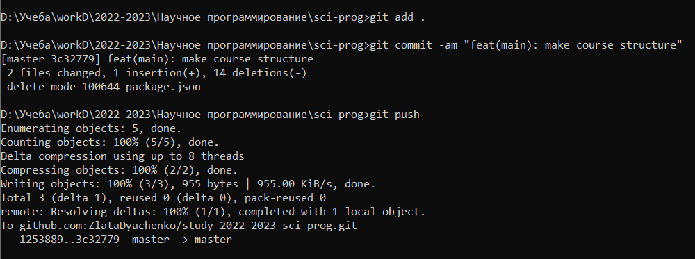

---
## Front matter
lang: ru-RU
title: "Отчет по лабораторной работе 1"
subtitle: "Дисциплина: Научное программирование"
author:
  - Дяченко З. К.
institute:
  - Российский университет дружбы народов, Москва, Россия
date: 15 сентября 2022

## i18n babel
babel-lang: russian
babel-otherlangs: english

## Formatting pdf
toc: false
toc-title: Содержание
slide_level: 2
aspectratio: 169
section-titles: true
theme: metropolis
header-includes:
 - \metroset{progressbar=frametitle,sectionpage=progressbar,numbering=fraction}
 - '\makeatletter'
 - '\beamer@ignorenonframefalse'
 - '\makeatother'
---

## Прагматика выполнения лабораторной работы

 Данная лабораторная работа выполнялась мной для приобретения практических навыков и умений работы с системой контроля версий Git.

## Цель выполнения лабораторной работы

Изучить идеологию и применение средств контроля версий и освоить умения по работе с git.

## Задачи выполнения лабораторной работы

Создать базовую конфигурацию для работы с git (рис. -@fig:001 – -@fig:002).

{#fig:001 width=70%}

## Задачи выполнения лабораторной работы

{#fig:002 width=70%}

## Задачи выполнения лабораторной работы

Создать ключ SSH (рис. -@fig:003 – -@fig:004).

{#fig:003 width=70%}

## Задачи выполнения лабораторной работы

{#fig:004 width=70%}

## Задачи выполнения лабораторной работы

Создать ключ PGP (рис. -@fig:005 – -@fig:007).

{#fig:005 width=70%}

## Задачи выполнения лабораторной работы

{#fig:006 width=70%}

## Задачи выполнения лабораторной работы

{#fig:007 width=70%}

## Задачи выполнения лабораторной работы

Настроить подписи git (рис. -@fig:008).

{#fig:008 width=70%}

## Задачи выполнения лабораторной работы

Создать локальный каталог для выполнения заданий по предмету (рис. -@fig:009 – -@fig:011).

{#fig:009 width=70%}

## Задачи выполнения лабораторной работы

{#fig:010 width=70%}

## Задачи выполнения лабораторной работы

{#fig:011 width=70%}

## Результаты выполнения лабораторной работы

Результатом выполнения работы стал созданный репозиторий, что отражает проделанную мной работу и полученные новые знания.
