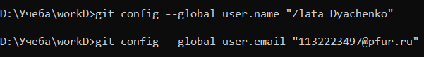
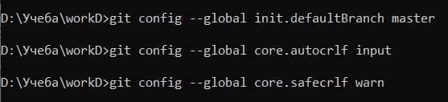
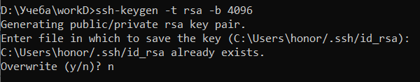
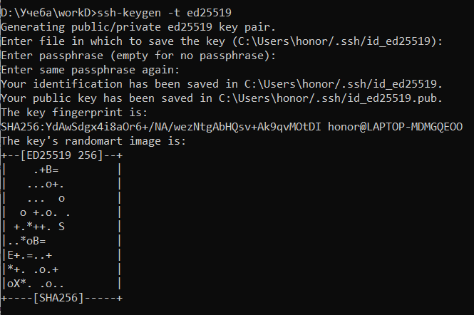
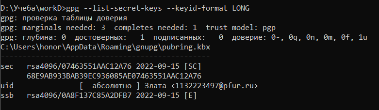
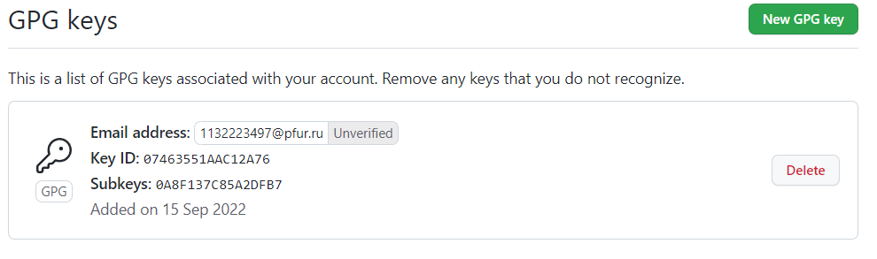
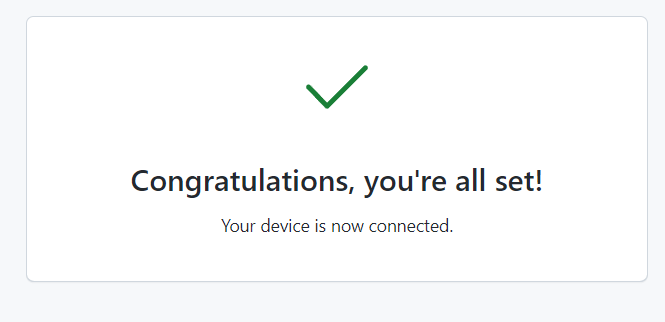
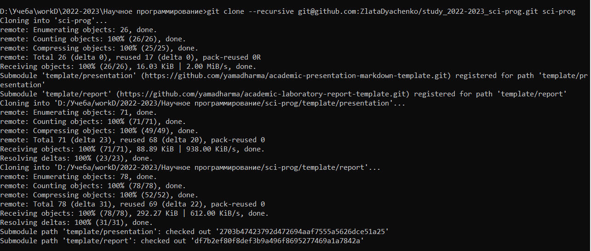
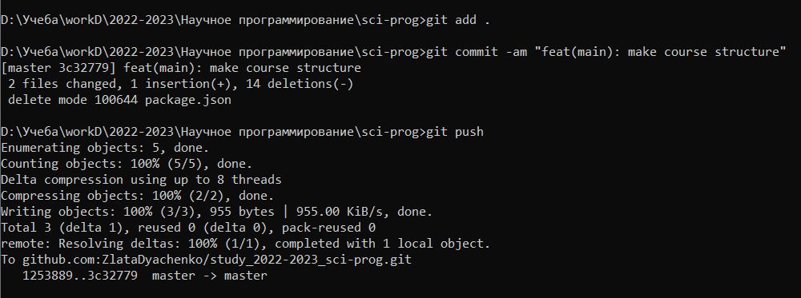

---
## Front matter
title: "Отчет по лабораторной работе №1"
subtitle: "Дисциплина: Научное программирование"
author: "Выполнила Дяченко Злата Константиновна, НПМмд-02-22"

## Generic otions
lang: ru-RU
toc-title: "Содержание"

## Bibliography
# bibliography: bib/cite.bib
csl: /home/wdoborschuk/work/2022-2023/МОЗИиИБ/infosec/.report/pandoc/csl/gost-r-7-0-5-2008-numeric.csl

## Pdf output format
toc: true # Table of contents
toc-depth: 2
lof: true # List of figures
lot: true # List of tables
fontsize: 12pt
linestretch: 1.5
papersize: a4
documentclass: scrreprt
## I18n polyglossia
polyglossia-lang:
  name: russian
  options:
   - spelling=modern
   - babelshorthands=true
polyglossia-otherlangs:
  name: english
## I18n babel
babel-lang: russian
babel-otherlangs: english
## Fonts
mainfont: PT Serif
romanfont: PT Serif
sansfont: PT Sans
monofont: PT Mono
mainfontoptions: Ligatures=TeX
romanfontoptions: Ligatures=TeX
sansfontoptions: Ligatures=TeX,Scale=MatchLowercase
monofontoptions: Scale=MatchLowercase,Scale=0.9
## Biblatex
biblatex: true
biblio-style: "gost-numeric"
biblatexoptions:
  - parentracker=true
  - backend=biber
  - hyperref=auto
  - language=auto
  - autolang=other*
  - citestyle=gost-numeric
## Pandoc-crossref LaTeX customization
figureTitle: "Рис."
tableTitle: "Таблица"
listingTitle: "Листинг"
lofTitle: "Список иллюстраций"
lotTitle: "Список таблиц"
lolTitle: "Листинги"
## Misc options
indent: true
header-includes:
  - \usepackage{indentfirst}
  - \usepackage{float} # keep figures where there are in the text
  - \floatplacement{figure}{H} # keep figures where there are in the text
---

# Цель работы

Изучить идеологию и применение средств контроля версий и освоить умения по работе с git.

# Задание

– Создать базовую конфигурацию для работы с git.   
– Создать ключ SSH.   
– Создать ключ PGP.   
– Настроить подписи git.   
– Зарегистрироваться на Github.   
– Создать локальный каталог для выполнения заданий по предмету.   

# Теоретическое введение

Системы контроля версий (Version Control System, VCS) применяются при работе нескольких человек над одним проектом. Обычно основное дерево проекта хранится в локальном или удалённом репозитории, к которому настроен доступ для участников проекта. При внесении изменений в содержание проекта система контроля версий позволяет их производить откат к любой более ранней версии проекта, если это требуется.
Система контроля версий Git представляет собой набор программ командной строки. Доступ к ним можно получить из терминала посредством ввода команды git с различными опциями.

# Выполнение лабораторной работы

## Шаг 1

Создала ранее учётную запись на https://github.com и заполнила основные данные. С помощью команд, представленных на Рисунке 1 (рис. -@fig:001), в командной строке задала имя и email владельца репозитория.

{#fig:001 width=70%}

С помощью команд, представленных на Рисунке 2 (рис. -@fig:002), настроила utf-8 в выводе сообщений git.

{#fig:002 width=70%}

С помощью команд, представленных на Рисунке 3 (рис. -@fig:003), задала имя начальной ветки, параметр autocrlf и параметр safecrlf.

{#fig:003 width=70%}

## Шаг 2

Создала ключ ssh по алгоритму rsa размером 4096 бит, что показано на Рисунке 4 (рис. -@fig:004).

{#fig:004 width=70%}

Создала ключ ssh по алгоритму ed25519, что показано на Рисунке 5 (рис. -@fig:005).

{#fig:005 width=70%}

## Шаг 3

Сгенерировала ключ pgp с помощью команды, показанной на Рисунке 6 (рис. -@fig:006).

{#fig:006 width=70%}

## Шаг 4

Вывела список ключей и скопировала отпечаток приватного ключа. На Рисунке 7 (рис. -@fig:007) показан результат выполнения команды.

{#fig:007 width=70%}

## Шаг 5

Экспортировала ключ с помощью команды, показанной на Рисунке 8 (рис. -@fig:008) и скопировала его.

{#fig:008 width=70%}

Перешла в настройки GitHub, нажала на кнопку New GPG key и вставила полученный ключ в поле ввода. Новый PGP ключ был добавлен, что подтверждает Рисунок 9 (рис. -@fig:009).

{#fig:009 width=70%}

## Шаг 6

Используя введёный email, указала Git применять его при подписи коммитов с помощью команд, показанных на Рисунке 10 (рис. -@fig:010).

{#fig:010 width=70%}

## Шаг 7

Авторизовалась через браузер, выполнив сначала команду, показанную на Рисунке 11 (рис. -@fig:011), и ответив на несколько вопросов.

{#fig:011 width=70%}

В результате получила сообщение, продемонстрированное на Рисунке 12 (рис. -@fig:012).

{#fig:012 width=70%}

## Шаг 8

Создала папку, имеющую имя соответствующее названию курса и перешла в нее с помощью команд, показанных на Рисунке 13 (рис. -@fig:013).

{#fig:013 width=70%}

Создала репозиторий, скопировав шаблонный репозиторий с помощью команды, показанной на Рисунке 14 (рис. -@fig:014) и Рисунке 15 (рис. -@fig:015).

{#fig:014 width=70%}

{#fig:015 width=70%}

Удалила файл *package.json*, создала необходимые каталоги и отправила файлы на сервер, что продемонстрированно на Рисунке 16 (рис. -@fig:016).

{#fig:016 width=70%}

# Выводы

Я изучила идеологию и применение средств контроля версий, а также освоила умения по работе с git. Результаты работы находятся в [репозитории на GitHub](https://github.com/ZlataDyachenko/workD), а также есть [скринкаст выполнения лабораторной работы](https://youtu.be/FDO4d9H0m5w).

# Список литературы{.unnumbered}

::: {#refs}
:::
