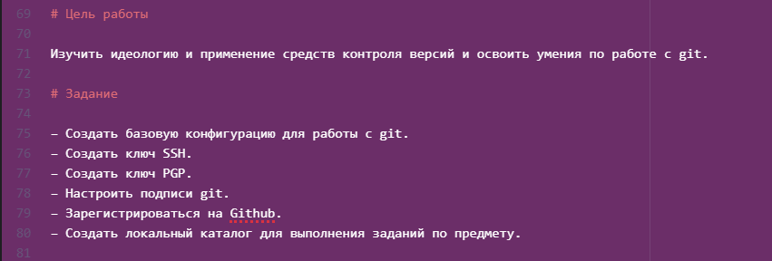
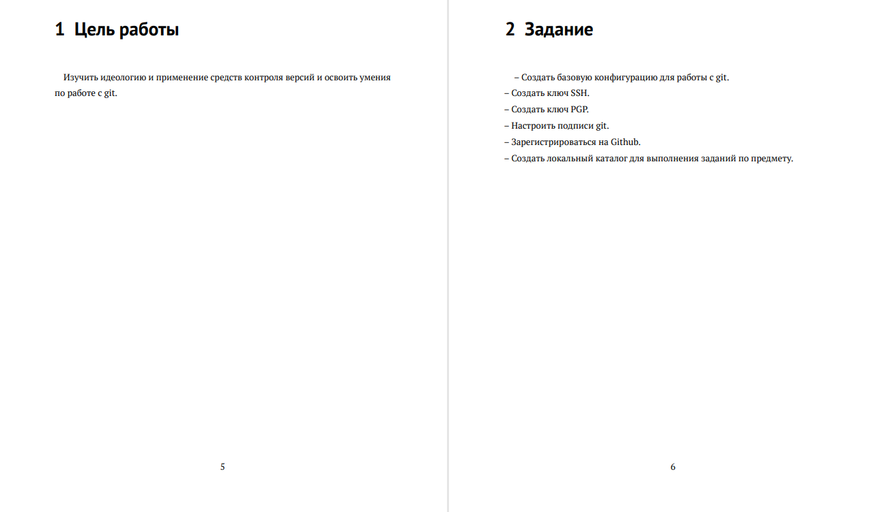
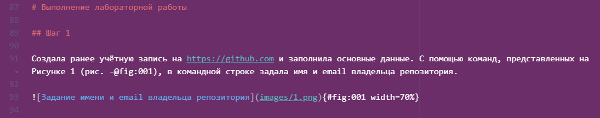
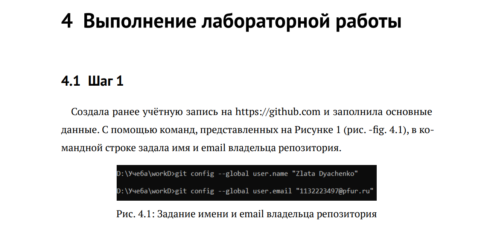

---
## Front matter
title: "Отчет по лабораторной работе №2"
subtitle: "Дисциплина: Научное программирование"
author: "Выполнила Дяченко Злата Константиновна, НПМмд-02-22"

## Generic otions
lang: ru-RU
toc-title: "Содержание"

## Pdf output format
toc: true # Table of contents
toc-depth: 2
lof: true # List of figures
lot: true # List of tables
fontsize: 12pt
linestretch: 1.5
papersize: a4
documentclass: scrreprt
## I18n polyglossia
polyglossia-lang:
  name: russian
  options:
   - spelling=modern
   - babelshorthands=true
polyglossia-otherlangs:
  name: english
## I18n babel
babel-lang: russian
babel-otherlangs: english
## Fonts
mainfont: PT Serif
romanfont: PT Serif
sansfont: PT Sans
monofont: PT Mono
mainfontoptions: Ligatures=TeX
romanfontoptions: Ligatures=TeX
sansfontoptions: Ligatures=TeX,Scale=MatchLowercase
monofontoptions: Scale=MatchLowercase,Scale=0.9
## Biblatex
biblatex: true
biblio-style: "gost-numeric"
biblatexoptions:
  - parentracker=true
  - backend=biber
  - hyperref=auto
  - language=auto
  - autolang=other*
  - citestyle=gost-numeric
## Pandoc-crossref LaTeX customization
figureTitle: "Рис."
tableTitle: "Таблица"
listingTitle: "Листинг"
lofTitle: "Список иллюстраций"
lotTitle: "Список таблиц"
lolTitle: "Листинги"
## Misc options
indent: true
header-includes:
  - \usepackage{indentfirst}
  - \usepackage{float} # keep figures where there are in the text
  - \floatplacement{figure}{H} # keep figures where there are in the text
---

# Цель работы

Научиться оформлять отчёты с помощью легковесного языка разметки Markdown.

# Задание

Сделать отчёт по предыдущей лабораторной работе в формате Markdown.

# Выполнение лабораторной работы

## Шаг 1

Для работы с файлами формата .md я использовала текстовый редактор Atom. При создании отчетов и презентаций также использовала предоставленные шаблоны. Названия разделов отчета являются заголовками первого уровня и обозначаются с помощью символа '#' (рис - @fig:001). Для того, чтобы каждый пункт списка заданий был написан на новой строке, в конце каждого пункта добавляла больше 2 пробелов. В формате .pdf эта часть отчета выглядит, как на Рисунке 2 (рис - @fig:002).

{#fig:001 width=70%}

{#fig:002 width=70%}

## Шаг 2

При описании выполненных шагов использовались заголовки второго уровня. При создании отчета использовались также ссылки и ссылки на изображения в локальной папке, что показано на Рисунке 3 (рис. - @fig:003). В формате .pdf ссылка и изображение выглядят, как на Рисунке 4 (рис. - @fig:004).

{#fig:003 width=70%}

{#fig:004 width=70%}

# Выводы

Я научилась оформлять отчеты с помощью легковесного языка разметки Markdown. Результаты работы находятся в [репозитории на GitHub](https://github.com/ZlataDyachenko), а также есть [скринкаст выполнения лабораторной работы](https://www.youtube.com/watch?v=-uxWZaiu2xk).
