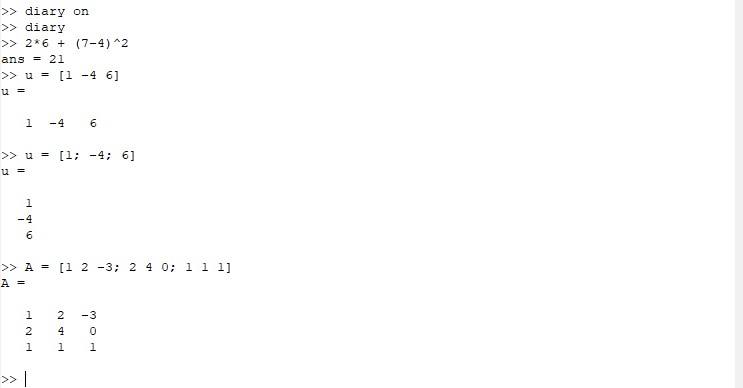
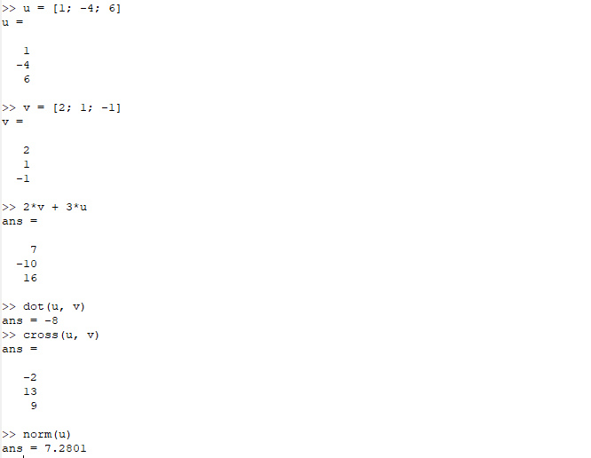
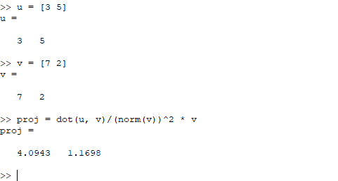
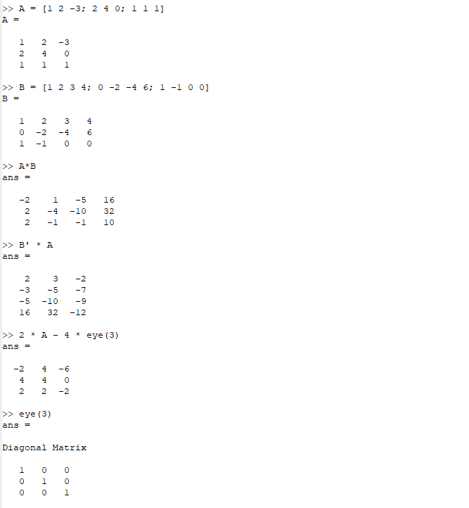
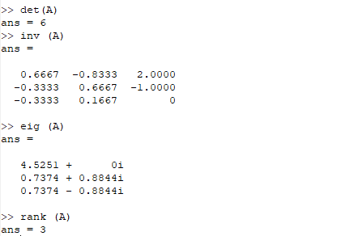
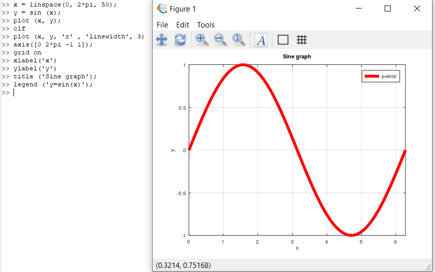
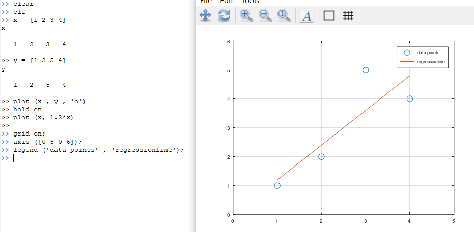
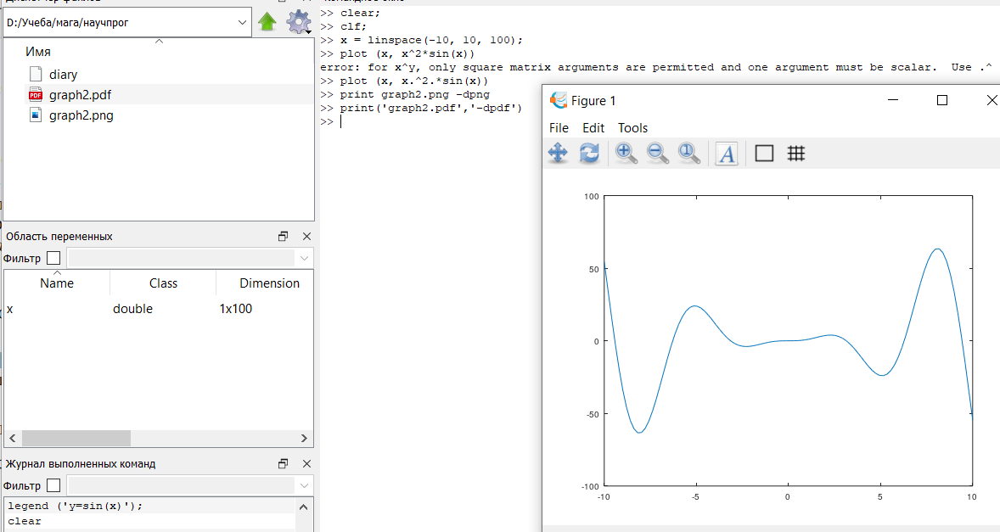
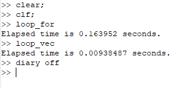

---
## Front matter
lang: ru-RU
title: "Отчет по лабораторной работе 3"
subtitle: "Дисциплина: Научное программирование"
author:
  - Дяченко З. К.
institute:
  - Российский университет дружбы народов, Москва, Россия
date: 13 октября 2022

## i18n babel
babel-lang: russian
babel-otherlangs: english

## Formatting pdf
toc: false
toc-title: Содержание
slide_level: 2
aspectratio: 169
section-titles: true
theme: metropolis
header-includes:
 - \metroset{progressbar=frametitle,sectionpage=progressbar,numbering=fraction}
 - '\makeatletter'
 - '\beamer@ignorenonframefalse'
 - '\makeatother'
---

## Прагматика выполнения лабораторной работы

Данная лабораторная работа выполнялась мной для приобретения практических навыков работы с Octave.

## Цель выполнения лабораторной работы

Научиться работать с Octave.

## Задачи выполнения лабораторной работы

Ознакомиться с простейшими операциями (рис. - @fig:001).

{#fig:001 width=70%}

## Задачи выполнения лабораторной работы

Ознакомиться с операциями с векторами (рис. - @fig:002).

{#fig:002 width=70%}

## Задачи выполнения лабораторной работы

Вычислить проектор (рис. - @fig:003).

{#fig:003 width=70%}

## Задачи выполнения лабораторной работы

Ознакомиться с операциями с матрицами (рис. - @fig:004 - рис. - @fig:005).

{#fig:004 width=70%}

## Задачи выполнения лабораторной работы

{#fig:005 width=70%}

## Задачи выполнения лабораторной работы

Построить график функции (рис. - @fig:006).

{#fig:006 width=70%}

## Задачи выполнения лабораторной работы

Построить два графика на одном чертеже (рис. - @fig:007).

{#fig:007 width=70%}

## Задачи выполнения лабораторной работы

Построить график функции $y=x^2\sin x$ (рис. - @fig:008).

{#fig:008 width=70%}

## Задачи выполнения лабораторной работы

Сравнить эффективности работы с циклами и операций с векторами (рис. - @fig:009).

{#fig:009 width=70%}

## Результаты выполнения лабораторной работы

Результатом выполнения работы стали построенные графики и полученные величины длительности работы вычислений, что отражает проделанную мной работу и полученные новые знания.
