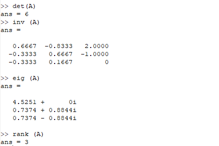
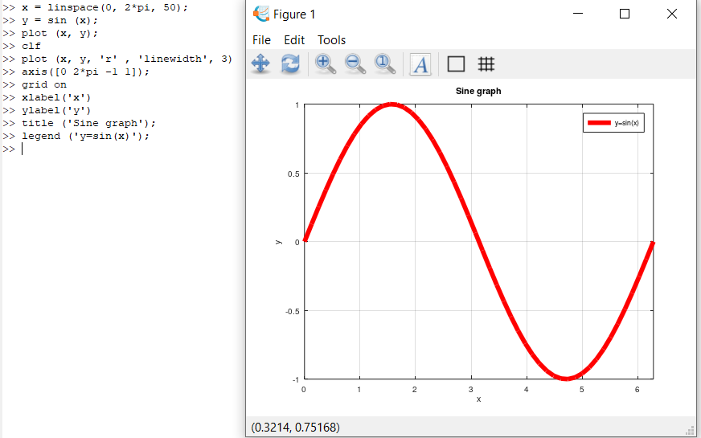
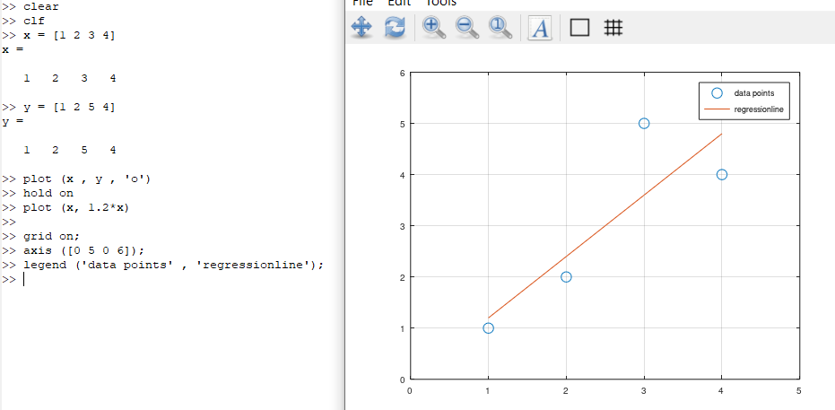
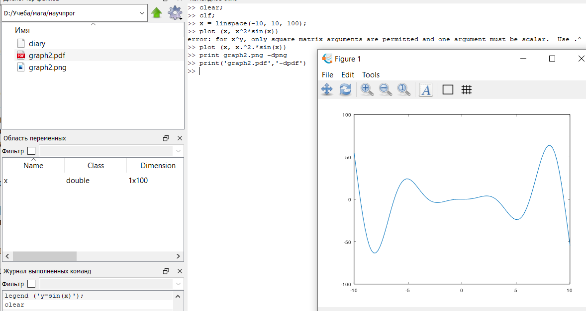
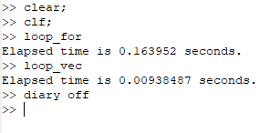

---
## Front matter
title: "Отчет по лабораторной работе №3"
subtitle: "Дисциплина: Научное программирование"
author: "Выполнила Дяченко Злата Константиновна, НПМмд-02-22"

# Generic otions
lang: ru-RU
toc-title: "Содержание"

# Bibliography

# Pdf output format
toc: true # Table of contents
toc_depth: 2
lof: true # List of figures
lot: true # List of tables
fontsize: 12pt
linestretch: 1.5
papersize: a4
documentclass: scrreprt
## I18n
polyglossia-lang:
  name: russian
  options:
  - spelling=modern
  - babelshorthands=true
polyglossia-otherlangs:
  name: english
### Fonts
mainfont: PT Serif
romanfont: PT Serif
sansfont: PT Sans
monofont: PT Mono
mainfontoptions: Ligatures=TeX
romanfontoptions: Ligatures=TeX
sansfontoptions: Ligatures=TeX,Scale=MatchLowercase
monofontoptions: Scale=MatchLowercase,Scale=0.9
## Biblatex
biblatex: true
biblio-style: "gost-numeric"
biblatexoptions:
  - parentracker=true
  - backend=biber
  - hyperref=auto
  - language=auto
  - autolang=other*
  - citestyle=gost-numeric
## Misc options
indent: true
header-includes:
  - \linepenalty=10 # the penalty added to the badness of each line within a paragraph (no associated penalty node) Increasing the value makes tex try to have fewer lines in the paragraph.
  - \interlinepenalty=0 # value of the penalty (node) added after each line of a paragraph.
  - \hyphenpenalty=50 # the penalty for line breaking at an automatically inserted hyphen
  - \exhyphenpenalty=50 # the penalty for line breaking at an explicit hyphen
  - \binoppenalty=700 # the penalty for breaking a line at a binary operator
  - \relpenalty=500 # the penalty for breaking a line at a relation
  - \clubpenalty=150 # extra penalty for breaking after first line of a paragraph
  - \widowpenalty=150 # extra penalty for breaking before last line of a paragraph
  - \displaywidowpenalty=50 # extra penalty for breaking before last line before a display math
  - \brokenpenalty=100 # extra penalty for page breaking after a hyphenated line
  - \predisplaypenalty=10000 # penalty for breaking before a display
  - \postdisplaypenalty=0 # penalty for breaking after a display
  - \floatingpenalty = 20000 # penalty for splitting an insertion (can only be split footnote in standard LaTeX)
  - \raggedbottom # or \flushbottom
  - \usepackage{float} # keep figures where there are in the text
  - \floatplacement{figure}{H} # keep figures where there are in the text
---

# Цель работы

Научиться работать с Octave.

# Задание

Ознакомиться с простейшими операциями, операциями с векторами и матрицами, построить графики функций и сравнить эффективность работы с циклами и операций с векторами.

# Выполнение лабораторной работы

## Шаг 1

Включила журналирование сессии с помощью *diary*, вычислила значение выражения, задала вектор-строку и вектор-столбец, а также матрицу, используя показанные на Рисунке 1 (рис - @fig:001) строки.

{#fig:001 width=70%}

## Шаг 2

Задала два вектор-столбца $\vec{u}$ и $\vec{v}$. Выполнила их сложение, скалярное и векторное умножения и вычислила норму вектора, используя строки, показанные на Рисунке 2 (рис - @fig:002).

{#fig:002 width=70%}

## Шаг 3

Задала два вектор-строки $\vec{u}$ и $\vec{v}$ и вычислила проекцию вектора $\vec{u}$ на вектор $\vec{v}$ с помощью строки *proj = dot(u, v)/(norm(v))^2 * v*, что показано на Рисунке 3 (рис - @fig:003).

{#fig:003 width=70%}

## Шаг 4

Задала две матрицы *A* и *B*, вычислила их произведение, произведение транспонированной матрицы *B* и *A*, разницу матриц, где *eye(3)* - единичная матрица. Выполнение операций показано на Рисунке 4 (рис - @fig:004). Кроме того, нашла определитель, обратную матрицу, собственные значения матрицы и ее ранг, используя показанные на Рисунке 5 (рис - @fig:005) строки.

{#fig:004 width=70%}

{#fig:005 width=70%}

## Шаг 5

Создала вектор значений *x* с помощью команды linspace(начальное_значение, конечное_значение, n), которая создаёт вектор-строку из *n* равномерно распределённых значений на заданном интервале. Чем меньше приращение, тем более гладкой будет выглядеть кривая. Точка с запятой в конце строки предназначена для подавления вывода на экран. Задала также вектор *y* и построила график, показанный на Рисунке 6 (рис - @fig:006).

{#fig:006 width=70%}

Для улучшения внешнего вида графика очистила получившийся до этого график, задала красный цвет для линии и ее толщину, подогнала диапазон осей, нарисовала сетку, подписала оси, добавила заголовок графика и задала легенду. Получившийся график показан на Рисунке 7 (рис - @fig:007).

{#fig:007 width=70%}

## Шаг 6

Очистила память и рабочую область фигуры. Задала два вектора и начертила точки, используя в качестве маркеров кружочки. График представлен на Рисунке 8 (рис - @fig:008).

{#fig:008 width=70%}

Для добавления еще одного графика, а именно графика регрессии, использовала команду *hold on*. Задала сетку, оси и легенду. Получившийся график представлен на Рисунке 9 (рис - @fig:009).

{#fig:009 width=70%}

## Шаг 7

Для построения графика $y=x^2 \sin x$ очистила память и рабочую область фигуры. Задала вектор $\vec{x}$ и использовала поэлементное возведение в степень и поэлементное умножение для построения графика. Получившийся график, представленный на Рисунке 10 (рис - @fig:010), сохранила в двух форматах.

{#fig:010 width=70%}

## Шаг 8

Для сравнения эффективности работы с циклами и операций с векторами очистила память и рабочую область фигуры. Создала файл *loop_for.m*, содержимое которого представлено на Рисунке 11 (рис - @fig:011). Код в данном файле вычисляет сумму $\sum_{n=1}^{1000000} \frac{1}{n^2}$ с помощью цикла. Код, содержащийся в файле *loop_vec.m*, представленный на Рисунке 12 (рис - @fig:012), вычисляет эту сумму с помощью операций с векторами. Результаты выполнения данных файлов представлены на Рисунке 13 (рис - @fig:013). Вычисление суммы с помощью операций с векторами оказалось в 17,5 раз быстрее, чем вычисление с помощью цикла.

{#fig:011 width=70%}

{#fig:012 width=70%}

{#fig:013 width=70%}

# Выводы

Я ознакомилась с Octave, а именно с работой с простейшими операциями, операциями с векторами и матрицами, построить графики функций и сравнить эффективность работы с циклами и операций с векторами. Результаты работы находятся в [репозитории на GitHub](https://github.com/ZlataDyachenko), а также есть [скринкаст выполнения лабораторной работы](https://www.youtube.com/watch?v=bGZ6UN-K-28).
