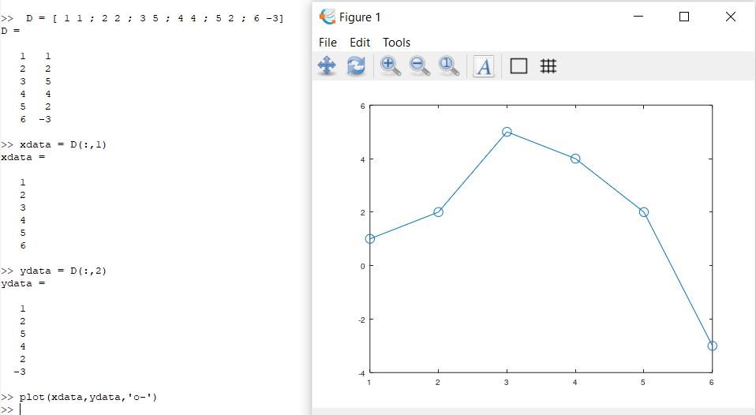
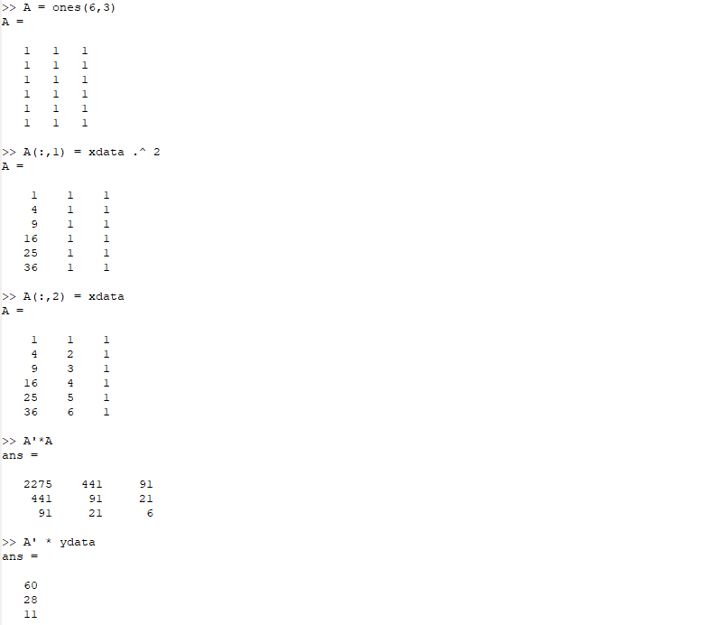
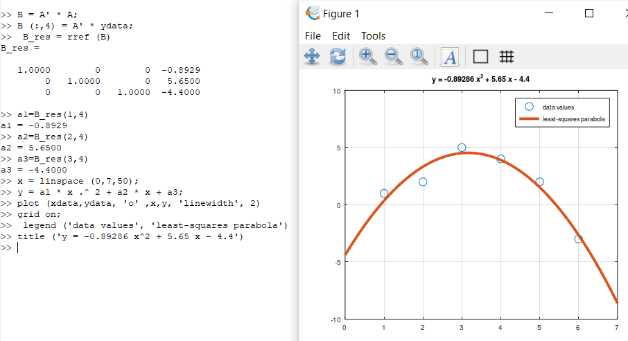
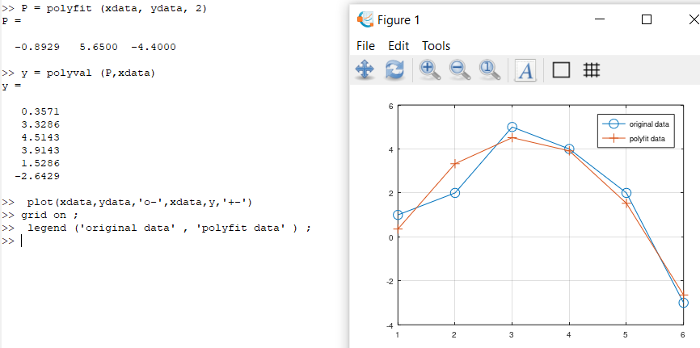
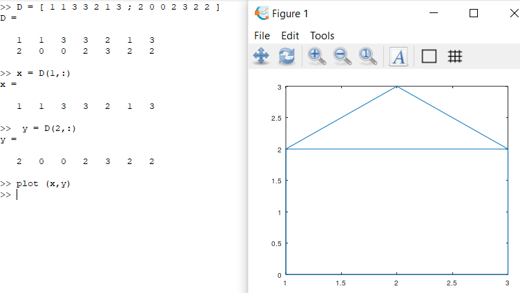
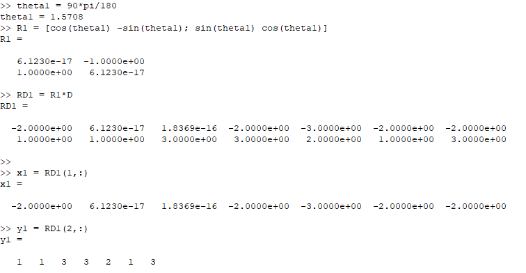
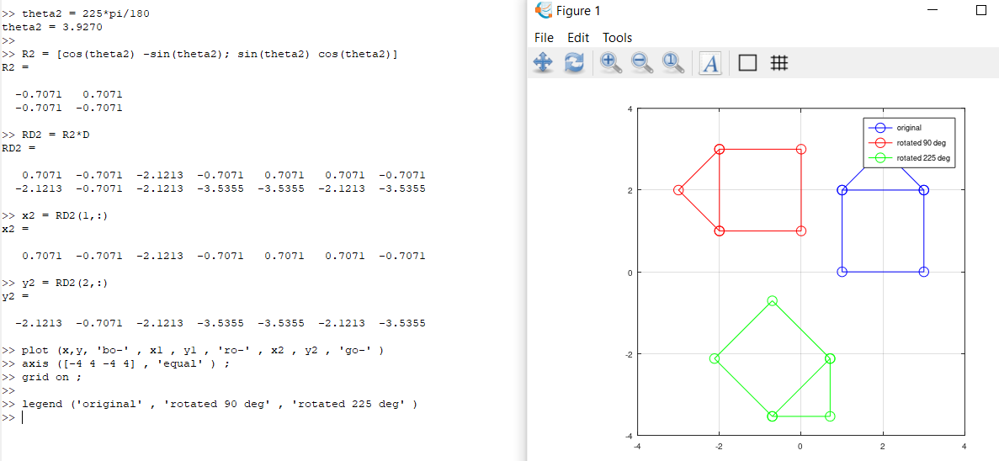
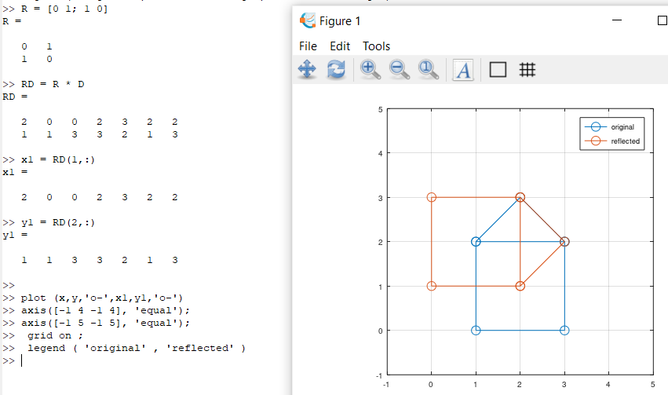
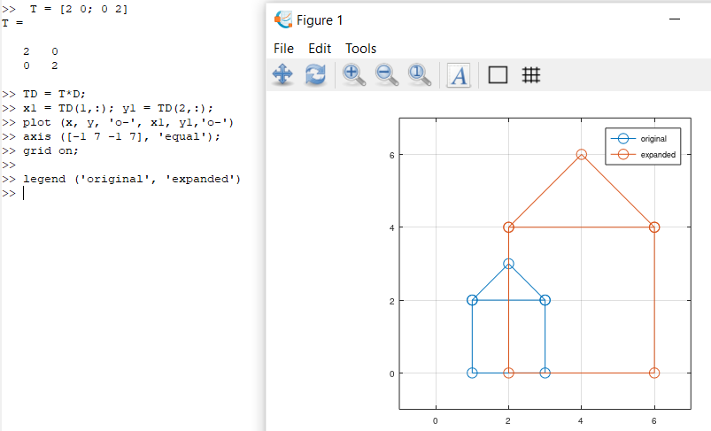

---
## Front matter
title: "Отчет по лабораторной работе №5"
subtitle: "Дисциплина: Научное программирование"
author: "Выполнила Дяченко Злата Константиновна, НПМмд-02-22"

# Generic otions
lang: ru-RU
toc-title: "Содержание"

# Bibliography

# Pdf output format
toc: true # Table of contents
toc_depth: 2
lof: true # List of figures
lot: true # List of tables
fontsize: 12pt
linestretch: 1.5
papersize: a4
documentclass: scrreprt
## I18n
polyglossia-lang:
  name: russian
  options:
  - spelling=modern
  - babelshorthands=true
polyglossia-otherlangs:
  name: english
### Fonts
mainfont: PT Serif
romanfont: PT Serif
sansfont: PT Sans
monofont: PT Mono
mainfontoptions: Ligatures=TeX
romanfontoptions: Ligatures=TeX
sansfontoptions: Ligatures=TeX,Scale=MatchLowercase
monofontoptions: Scale=MatchLowercase,Scale=0.9
## Biblatex
biblatex: true
biblio-style: "gost-numeric"
biblatexoptions:
  - parentracker=true
  - backend=biber
  - hyperref=auto
  - language=auto
  - autolang=other*
  - citestyle=gost-numeric
## Misc options
indent: true
header-includes:
  - \linepenalty=10 # the penalty added to the badness of each line within a paragraph (no associated penalty node) Increasing the value makes tex try to have fewer lines in the paragraph.
  - \interlinepenalty=0 # value of the penalty (node) added after each line of a paragraph.
  - \hyphenpenalty=50 # the penalty for line breaking at an automatically inserted hyphen
  - \exhyphenpenalty=50 # the penalty for line breaking at an explicit hyphen
  - \binoppenalty=700 # the penalty for breaking a line at a binary operator
  - \relpenalty=500 # the penalty for breaking a line at a relation
  - \clubpenalty=150 # extra penalty for breaking after first line of a paragraph
  - \widowpenalty=150 # extra penalty for breaking before last line of a paragraph
  - \displaywidowpenalty=50 # extra penalty for breaking before last line before a display math
  - \brokenpenalty=100 # extra penalty for page breaking after a hyphenated line
  - \predisplaypenalty=10000 # penalty for breaking before a display
  - \postdisplaypenalty=0 # penalty for breaking after a display
  - \floatingpenalty = 20000 # penalty for splitting an insertion (can only be split footnote in standard LaTeX)
  - \raggedbottom # or \flushbottom
  - \usepackage{float} # keep figures where there are in the text
  - \floatplacement{figure}{H} # keep figures where there are in the text
---

# Цель работы

Научиться совершать матричные преобразования в Octave.

# Задание

Выполнить подгонку полиномиальной кривой, совершить матричные преобразования: вращение, отражение, дилатация.

# Выполнение лабораторной работы

## Шаг 1

Ввела матрицу данных в Octave и извлекла вектора 𝑥 и 𝑦. Точки построила на графике, который показан на Рисунке 1 (рис - @fig:001), как и выполненные для его получения команды.

{#fig:001 width=70%}

Уравнение вида $𝑦 = 𝑎𝑥^2 + 𝑏𝑥 + 𝑐$ с исходными данными предстает в виде системы линейных уравнений. Нашла решение по методу наименьших квадратов (рис - @fig:002) и использовала его для решения задачи методом Гаусса, построила график, представленный на Рисунке 3 (рис - @fig:003).

{#fig:002 width=70%}

{#fig:003 width=70%}

Для подгонки полинома также можно использовать встроенную функцию polyfit, что продемонстрированно на Рисунке 4 (рис - @fig:004). Был получен подгоночный полином, рассчитаны его значения в точках, а исходные и подгоночные данные представлены на графике.

{#fig:004 width=70%}

## Шаг 2

Задала матрицу, содержащую в качестве столбцов точку графа. Изображение этого графа представлено на Рисунке 5 (рис - @fig:005).  

{#fig:005 width=70%}

Для вращения использовала метод умножения на специальную матрицу. Для поворота графа дома на 90∘ и 225∘ вначале перевела угол в радианы, а затем произвела умножение координат. Для угла в 90∘ команды показаны на Рисунке 6 (рис - @fig:006). Для угла в 225∘ все команды и построенный график показан на Рисунке 7 (рис - @fig:007).

{#fig:006 width=70%}

{#fig:007 width=70%}

## Шаг 3

Для отражения графа относительно прямой y=x использовала специальную матрицу. Получившийся график показан на Рисунке 8 (рис - @fig:008).

{#fig:008 width=70%}

## Шаг 4

Для дилатации также использовала умножение исходной матрицы на особую. На Рисунке 9 (рис - @fig:009) показано увеличение графа в два раза.

{#fig:009 width=70%}

# Выводы

Я ознакомилась с тем, как выполнить подгонку полиномиальной кривой, совершить матричные преобразования - вращение, отражение, дилатация - в Octave . Результаты работы находятся в [репозитории на GitHub](https://github.com/ZlataDyachenko), а также есть [скринкаст выполнения лабораторной работы](https://www.youtube.com/watch?v=UZ8wE8ylG9g).
