---
## Front matter
title: "Отчет по лабораторной работе №6"
subtitle: "Дисциплина: Научное программирование"
author: "Выполнила Дяченко Злата Константиновна, НПМмд-02-22"

# Generic otions
lang: ru-RU
toc-title: "Содержание"

# Bibliography

# Pdf output format
toc: true # Table of contents
toc_depth: 2
lof: true # List of figures
lot: true # List of tables
fontsize: 12pt
linestretch: 1.5
papersize: a4
documentclass: scrreprt
## I18n
polyglossia-lang:
  name: russian
  options:
  - spelling=modern
  - babelshorthands=true
polyglossia-otherlangs:
  name: english
### Fonts
mainfont: PT Serif
romanfont: PT Serif
sansfont: PT Sans
monofont: PT Mono
mainfontoptions: Ligatures=TeX
romanfontoptions: Ligatures=TeX
sansfontoptions: Ligatures=TeX,Scale=MatchLowercase
monofontoptions: Scale=MatchLowercase,Scale=0.9
## Biblatex
biblatex: true
biblio-style: "gost-numeric"
biblatexoptions:
  - parentracker=true
  - backend=biber
  - hyperref=auto
  - language=auto
  - autolang=other*
  - citestyle=gost-numeric
## Misc options
indent: true
header-includes:
  - \linepenalty=10 # the penalty added to the badness of each line within a paragraph (no associated penalty node) Increasing the value makes tex try to have fewer lines in the paragraph.
  - \interlinepenalty=0 # value of the penalty (node) added after each line of a paragraph.
  - \hyphenpenalty=50 # the penalty for line breaking at an automatically inserted hyphen
  - \exhyphenpenalty=50 # the penalty for line breaking at an explicit hyphen
  - \binoppenalty=700 # the penalty for breaking a line at a binary operator
  - \relpenalty=500 # the penalty for breaking a line at a relation
  - \clubpenalty=150 # extra penalty for breaking after first line of a paragraph
  - \widowpenalty=150 # extra penalty for breaking before last line of a paragraph
  - \displaywidowpenalty=50 # extra penalty for breaking before last line before a display math
  - \brokenpenalty=100 # extra penalty for page breaking after a hyphenated line
  - \predisplaypenalty=10000 # penalty for breaking before a display
  - \postdisplaypenalty=0 # penalty for breaking after a display
  - \floatingpenalty = 20000 # penalty for splitting an insertion (can only be split footnote in standard LaTeX)
  - \raggedbottom # or \flushbottom
  - \usepackage{float} # keep figures where there are in the text
  - \floatplacement{figure}{H} # keep figures where there are in the text
---

# Цель работы

Научиться работать с пределами, последовательностями и рядами, выполнять численное интегрирование с помощью Octave.

# Задание

Оценить предел, вычислить частичную сумму и сумму ряда, вычислить интеграл с помощью встроенной функции и по правилу средней точки .

# Выполнение лабораторной работы

## Шаг 1

Рассмотрим предел $\lim_{n\rightarrow\infty} (1+ \frac{1}{n})^n$. Для его оценки определила функцию как анонимную функцию и создала индексную переменную, состоящую из целых чисел от 0 до 9. Соответствующие команды показаны на Рисунке 1 (рис - @fig:001).

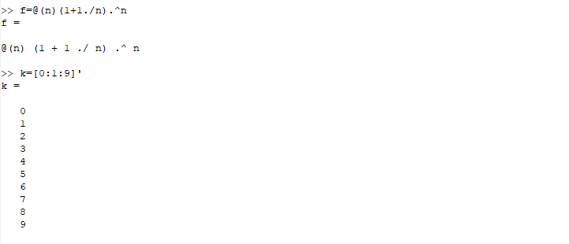{#fig:001 width=70%}

В качестве входных значений будем использовать степени 10. Получаем результат, показанный на Рисунке 2 (рис - @fig:002), то есть предел сходится к конечному значению 2,71828...

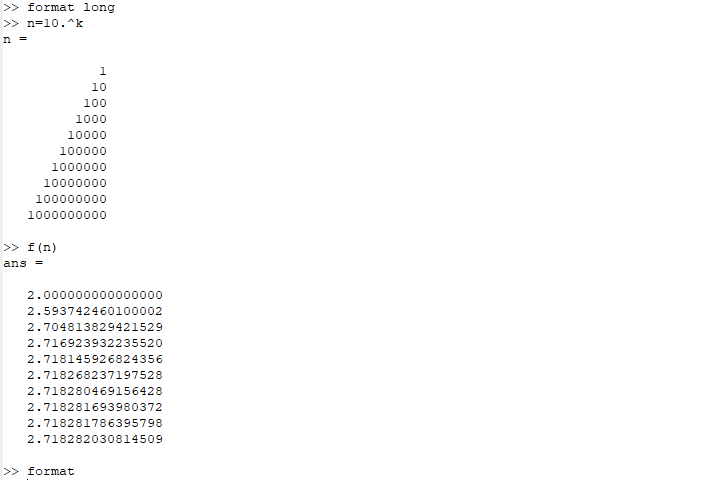{#fig:002 width=70%}

## Шаг 2

Рассмотрим ряд $\sum_{n=2}{\infty}a_n$, n-й член равен $a_n=\frac{1}{n(n+2)}$. Используя команды Octave, представленные на Рисунке 3 (рис - @fig:003), вычислила члены от 2 до 11, а затем, используя цикл, получила частичные суммы. Слагаемые и частичные суммы построила на графике, который показан на Рисунке 4 (рис - @fig:004).

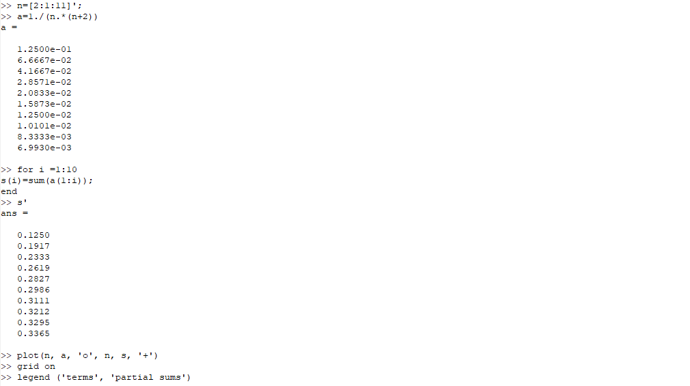{#fig:003 width=70%}

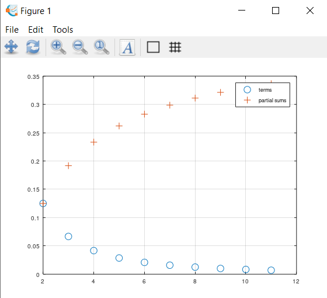{#fig:004 width=70%}

## Шаг 3

Для нахождение суммы первых 1000 членов гармонического ряда $\sum_{n=1}{1000} \frac{1}{n}$ сгенерировала члены ряда как вектор, а затем взяла их сумму, что показано на Рисунке 5 (рис - @fig:005). Сумма получилась равна 7,4855.

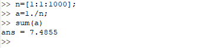{#fig:005 width=70%}

## Шаг 4

Для вычисления интеграла $\int_0^{\pi/2} e^{x^2}\cos(x)dx$ использовала встроенную команду, показанную на Рисунке 6 (рис - @fig:006).

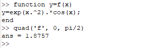{#fig:006 width=70%}

## Шаг 5

Для вычисления того же интеграла использовала также правило средней точки для n=100. Для этого написала скрипт, использующий цикл, который показан на Рисунке 7 (рис - @fig:007). Результат выполнения данного скрипта показан на Рисунке 8 (рис - @fig:008).  показано увеличение графа в два раза.

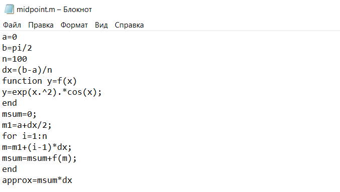{#fig:007 width=70%}

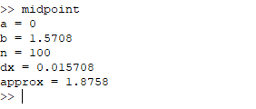{#fig:008 width=70%}

Так как Octave является векторным языком, написала скрипт, вычисляющий аппроксимацию средней точки с использованием векторов. Скрипт представлен на Рисунке 9 (рис - @fig:009), а результат его выполнения на Рисунке 10 (рис - @fig:010).

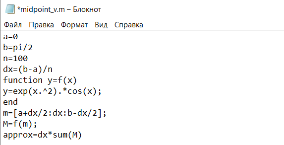{#fig:009 width=70%}

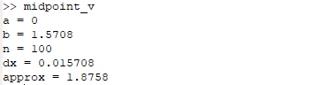{#fig:010 width=70%}

Полученные результаты отличаются в десятитысячной доле. Я также сравнила время выполнения каждого скрипта, что показано на Рисунке 11 (рис - @fig:011). Вычисление с помощью векторов работает чуть больше чем в три раза быстрее вычисления с использованием цикла.

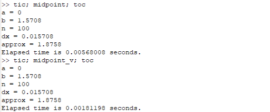{#fig:011 width=70%}

# Выводы

Я научилась работать с пределами, последовательностями и рядами, выполнять численное интегрирование с помощью Octave. Результаты работы находятся в [репозитории на GitHub](https://github.com/ZlataDyachenko), а также есть [скринкаст выполнения лабораторной работы](https://youtu.be/_tGMzRgYFAo).
