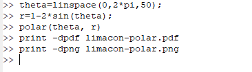
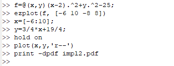
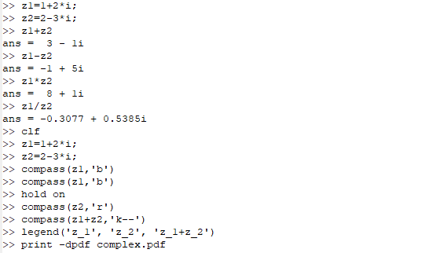
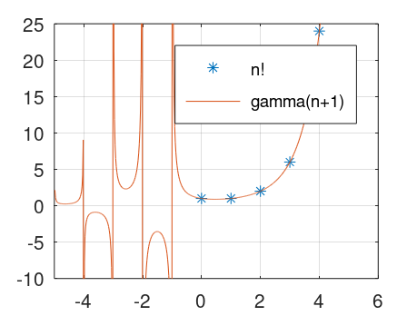

---
## Front matter
lang: ru-RU
title: "Отчет по лабораторной работе 7"
subtitle: "Дисциплина: Научное программирование"
author:
  - Дяченко З. К.
institute:
  - Российский университет дружбы народов, Москва, Россия
date: 25 ноября 2022

## i18n babel
babel-lang: russian
babel-otherlangs: english

## Formatting pdf
toc: false
toc-title: Содержание
slide_level: 2
aspectratio: 169
section-titles: true
theme: metropolis
header-includes:
 - \metroset{progressbar=frametitle,sectionpage=progressbar,numbering=fraction}
 - '\makeatletter'
 - '\beamer@ignorenonframefalse'
 - '\makeatother'
---

## Прагматика выполнения лабораторной работы

Данная лабораторная работа выполнялась мной для приобретения практических навыков работы с комплексными числами и специальными функциями, построением различных графиков с помощью Octave.

## Цель выполнения лабораторной работы

Научиться строить различные графики, работать с комплексными числами и специальными функциями.

## Задачи выполнения лабораторной работы

Построить параметрический график (рис. - @fig:001).

{#fig:001 width=70%}

## Задачи выполнения лабораторной работы

Построила улитку Паскаля в декартовых и полярных координатах координатах (рис. - @fig:002 - @fig:005).

{#fig:002 width=70%}

## Задачи выполнения лабораторной работы

{#fig:003 width=70%}

## Задачи выполнения лабораторной работы

{#fig:004 width=70%}

## Задачи выполнения лабораторной работы

{#fig:005 width=70%}

## Задачи выполнения лабораторной работы

Построить график неявной функции (рис. - @fig:006 - @fig:007).

{#fig:006 width=70%}

## Задачи выполнения лабораторной работы

{#fig:007 width=70%}

## Задачи выполнения лабораторной работы

Построить окружность и касательную к ней (рис - @fig:008 и - @fig:009).

{#fig:008 width=70%}

## Задачи выполнения лабораторной работы

{#fig:009 width=70%}

## Задачи выполнения лабораторной работы

Произвести основные арифметические операции с двумя комплексными числами и построить графики в комплексной плоскости (рис - @fig:010 и - @fig:011).

{#fig:010 width=70%}

## Задачи выполнения лабораторной работы

{#fig:011 width=70%}

## Задачи выполнения лабораторной работы

Построить графики функций $Г(x+1) и n!$ на одном графике (рис - @fig:012 - рис - @fig:015).

{#fig:012 width=70%}

## Задачи выполнения лабораторной работы

{#fig:013 width=70%}

## Задачи выполнения лабораторной работы

{#fig:014 width=70%}

## Задачи выполнения лабораторной работы

{#fig:015 width=70%}

## Результаты выполнения лабораторной работы

Результатом выполнения работы стали построенные параметрический график, график в полярных координатах, график неявной функции, график в комплексной плоскости, график специальной функции в Octave, что отражает проделанную мной работу и полученные новые знания.
