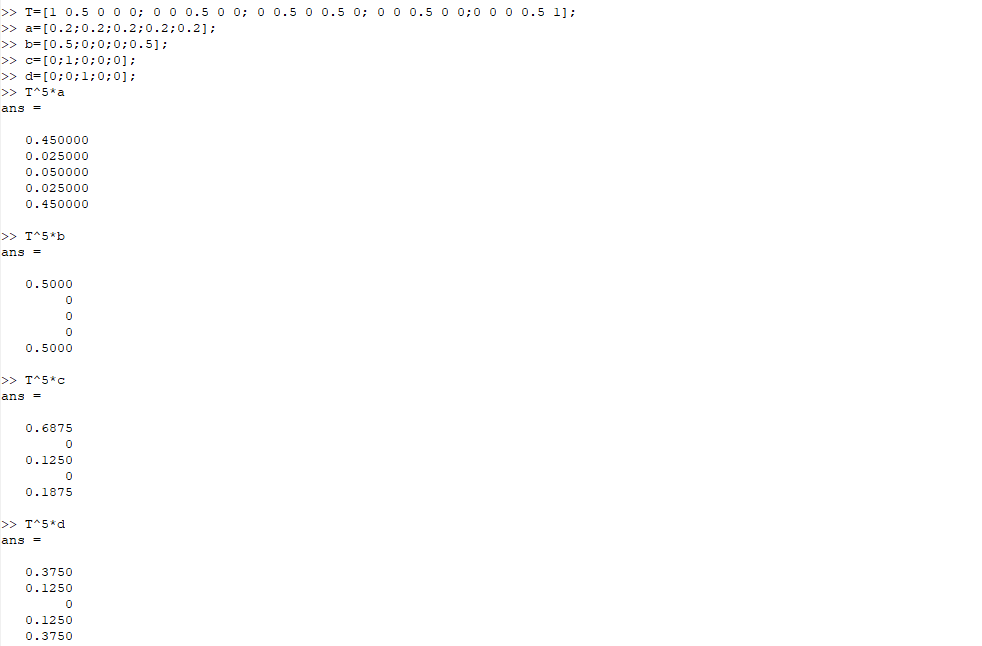

---
## Front matter
lang: ru-RU
title: "Отчет по лабораторной работе 8"
subtitle: "Дисциплина: Научное программирование"
author:
  - Дяченко З. К.
institute:
  - Российский университет дружбы народов, Москва, Россия
date: 15 декабря 2022

## i18n babel
babel-lang: russian
babel-otherlangs: english

## Formatting pdf
toc: false
toc-title: Содержание
slide_level: 2
aspectratio: 169
section-titles: true
theme: metropolis
header-includes:
 - \metroset{progressbar=frametitle,sectionpage=progressbar,numbering=fraction}
 - '\makeatletter'
 - '\beamer@ignorenonframefalse'
 - '\makeatother'
---

## Прагматика выполнения лабораторной работы

Данная лабораторная работа выполнялась мной для приобретения практических навыков нахождения собственных значений и собственных векторов матрицы: предсказывания, в каком состоянии в цепи Маркова окажемся через определенное количество ходов; нахождения вектора равновесного состояния для цепи Маркова с помощью Octave.

## Цель выполнения лабораторной работы

Научиться вычислять собственные значения и собственные векторы, предсказывать, в каком состоянии в цепи Маркова окажемся через определенное количество ходов, находить вектор равновесного состояния для цепи Маркова с помощью Octave.

## Задачи выполнения лабораторной работы

Найти собственные значения и собственные векторы матрицы (рис. - @fig:001).

{#fig:001 width=50%}

## Задачи выполнения лабораторной работы

Найти вероятности цепи Маркова после 5 шагов для четырех начальных векторов вероятностей (рис. - @fig:002).

{#fig:002 width=50%}

## Задачи выполнения лабораторной работы

Найти равновесное состояния для цепи Маркова (рис. - @fig:003).

{#fig:003 width=50%}

## Результаты выполнения лабораторной работы

Результатом выполнения работы стали вычисленные собственные значения и вектора, равновесное состояние цепи Маркова, предсказанные вероятности цепи Маркова через 5 шагов в Octave, что отражает проделанную мной работу и полученные новые знания.
