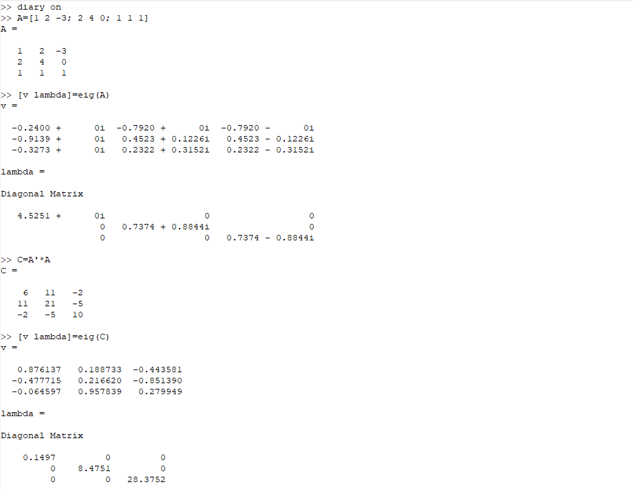
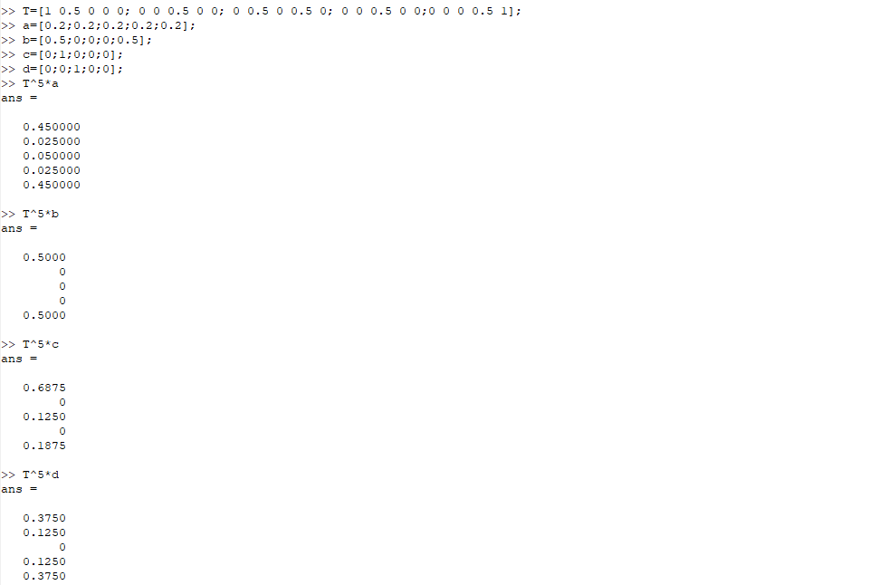
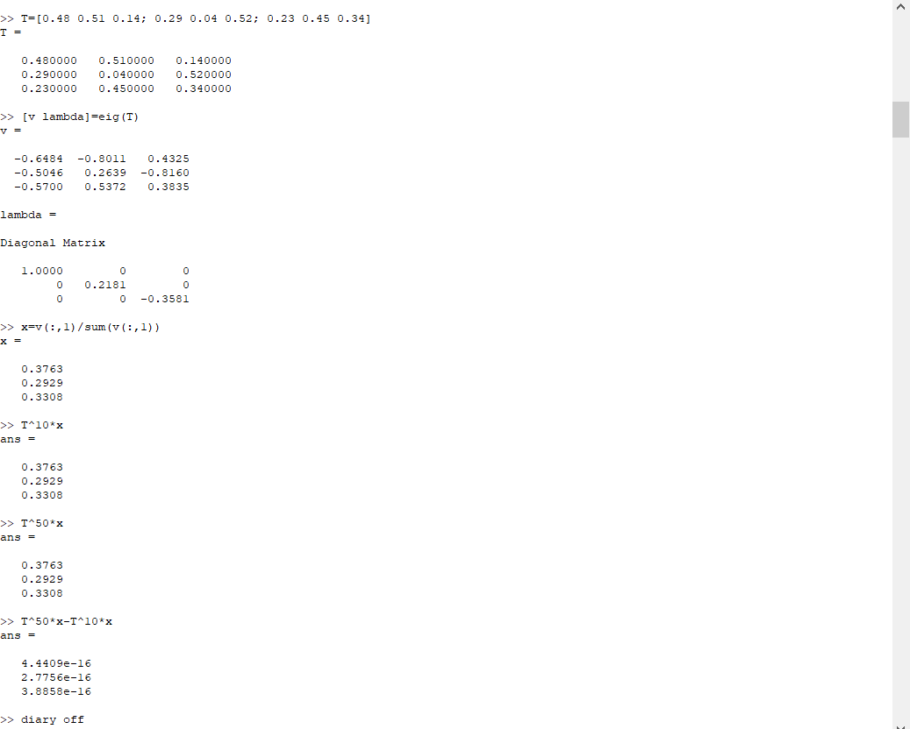

---
## Front matter
title: "Отчет по лабораторной работе №8"
subtitle: "Дисциплина: Научное программирование"
author: "Выполнила Дяченко Злата Константиновна, НПМмд-02-22"

# Generic otions
lang: ru-RU
toc-title: "Содержание"

# Bibliography

# Pdf output format
toc: true # Table of contents
toc_depth: 2
lof: true # List of figures
lot: true # List of tables
fontsize: 12pt
linestretch: 1.5
papersize: a4
documentclass: scrreprt
## I18n
polyglossia-lang:
  name: russian
  options:
  - spelling=modern
  - babelshorthands=true
polyglossia-otherlangs:
  name: english
### Fonts
mainfont: PT Serif
romanfont: PT Serif
sansfont: PT Sans
monofont: PT Mono
mainfontoptions: Ligatures=TeX
romanfontoptions: Ligatures=TeX
sansfontoptions: Ligatures=TeX,Scale=MatchLowercase
monofontoptions: Scale=MatchLowercase,Scale=0.9
## Biblatex
biblatex: true
biblio-style: "gost-numeric"
biblatexoptions:
  - parentracker=true
  - backend=biber
  - hyperref=auto
  - language=auto
  - autolang=other*
  - citestyle=gost-numeric
## Misc options
indent: true
header-includes:
  - \linepenalty=10 # the penalty added to the badness of each line within a paragraph (no associated penalty node) Increasing the value makes tex try to have fewer lines in the paragraph.
  - \interlinepenalty=0 # value of the penalty (node) added after each line of a paragraph.
  - \hyphenpenalty=50 # the penalty for line breaking at an automatically inserted hyphen
  - \exhyphenpenalty=50 # the penalty for line breaking at an explicit hyphen
  - \binoppenalty=700 # the penalty for breaking a line at a binary operator
  - \relpenalty=500 # the penalty for breaking a line at a relation
  - \clubpenalty=150 # extra penalty for breaking after first line of a paragraph
  - \widowpenalty=150 # extra penalty for breaking before last line of a paragraph
  - \displaywidowpenalty=50 # extra penalty for breaking before last line before a display math
  - \brokenpenalty=100 # extra penalty for page breaking after a hyphenated line
  - \predisplaypenalty=10000 # penalty for breaking before a display
  - \postdisplaypenalty=0 # penalty for breaking after a display
  - \floatingpenalty = 20000 # penalty for splitting an insertion (can only be split footnote in standard LaTeX)
  - \raggedbottom # or \flushbottom
  - \usepackage{float} # keep figures where there are in the text
  - \floatplacement{figure}{H} # keep figures where there are in the text
---

# Цель работы

Научиться вычислять собственные значения и собственные векторы, предсказывать, в каком состоянии в цепи Маркова окажемся через определенное количество ходов, находить вектор равновесного состояния для цепи Маркова с помощью Octave.

# Задание

Найти собственные значения и собственные векторы матрицы: предсказать, в каком состоянии в цепи Маркова окажемся через определенное количество ходов; найти вектор равновесного состояния для цепи Маркова.

# Выполнение лабораторной работы

## Шаг 1

Задала матрицу А и нашла ее собственные векторы и собственные значения с помощью команды eig с двумя выходными аргументами. Для получения матрицы с действительными собственными значениями, умножила входную матрицу на транспонированную матрицу. Соответствующие команды и результаты показаны на Рисунке 1 (рис - @fig:001).

{#fig:001 width=70%}

## Шаг 2

Рассмотрим марковскую цепь, для которой дана матрицы переходов T и четыре различных начальных векторов вероятности. Для нахождения вероятностей после 5 шагов возвела матрицу Т в пятую степень и умножила на начальный вектор вероятностей. Соответствующие команды и результаты показаны на Рисунке 2 (рис - @fig:002).

{#fig:002 width=70%}

## Шаг 3

Для нахождения равновесного состояния для цепи Маркова задала новую переходную матрицу и нашла его собственный вектор x для собственного значения равного 1,компоненты которого неотрицательны и в сумме дают 1. Данный вектор и является равновесным состоянием состоянием цепи. Нахождение данного вектора и проверка того, что это действительно равновесное состояние, показана на Рисунке 3 (рис - @fig:003).

{#fig:003 width=70%}

# Выводы

Я научилась вычислять собственные значения и собственные векторы, предсказывать, в каком состоянии в цепи Маркова окажемся через определенное количество ходов, находить вектор равновесного состояния для цепи Маркова с помощью Octave. Результаты работы находятся в [репозитории на GitHub](https://github.com/ZlataDyachenko), а также есть [скринкаст выполнения лабораторной работы](https://www.youtube.com/watch?v=rGMt7EYT4Mo).
