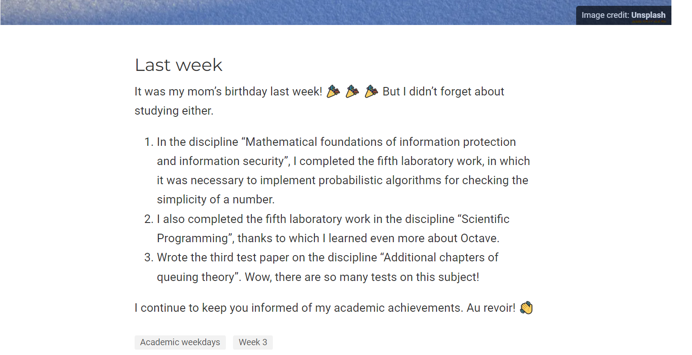

---
## Front matter
lang: ru-RU
title: "Отчет о выполнении 5 этапа индивидуального проекта"
subtitle: "Дисциплина: Научное программирование"
author:
  - Дяченко З.К.
institute:
  - Российский университет дружбы народов, Москва, Россия
date: 18 ноября 2022

## i18n babel
babel-lang: russian
babel-otherlangs: english

## Formatting pdf
toc: false
toc-title: Содержание
slide_level: 2
aspectratio: 169
section-titles: true
theme: metropolis
header-includes:
 - \metroset{progressbar=frametitle,sectionpage=progressbar,numbering=fraction}
 - '\makeatletter'
 - '\beamer@ignorenonframefalse'
 - '\makeatother'
---

# Информация

## Докладчик

:::::::::::::: {.columns align=center}
::: {.column width="70%"}

  * Дяченко Злата Константиновна
  * студентка группы НПМмд-02-22
  * кафедры прикладной информатики и теории вероятностей
  * Российский университет дружбы народов
  * [1132223497@rudn.ru](mailto:1132223497@rudn.ru)
  * <https://zlatadyachenko.github.io/>

:::
::: {.column width="30%"}

:::
::::::::::::::

# Вводная часть

## Актуальность

- Персональный научный сайт является визиткой для желающих ознакомиться с научными интересами и достижениями владельца.

## Объект и предмет исследования

- Сайт, созданный с помощью hugo
- Работа с git и github pages

## Цели и задачи

- Размещение двуязычного сайта на Github
- Сделать два поста

## Материалы и методы

- Созданная ранее заготовка сайта
- Дополнительные изображения
- Программное обеспечение для работы с Markdown

# Выполненные задачи

## Создание поддержки английского и русского языков

{#fig:001 width=70%}

## Размещение элементов сайта на обоих языках

{#fig:002 width=70%}

## Размещение элементов сайта на обоих языках

{#fig:003 width=70%}

## Размещение элементов сайта на обоих языках

{#fig:004 width=70%}

## Размещение контента на обоих языках

{#fig:005 width=70%}

## Создание поста

{#fig:006 width=70%}

## Создание поста

{#fig:007 width=70%}

## Создание поста о прошедшей неделе

{#fig:008 width=70%}

# Результаты

## Результаты

Результатом выполнения работы стала реализованная поддержка сайтом двух языков, а также публикация двух постов, что отражает проделанную мной работу и полученные новые знания.
