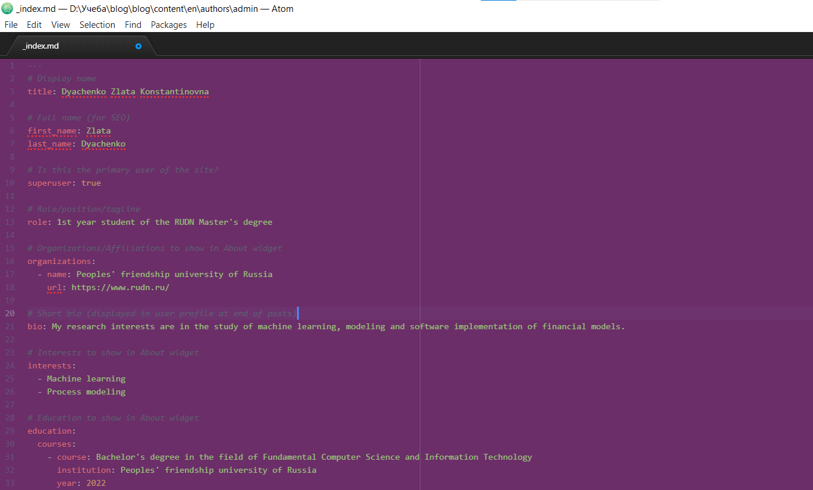
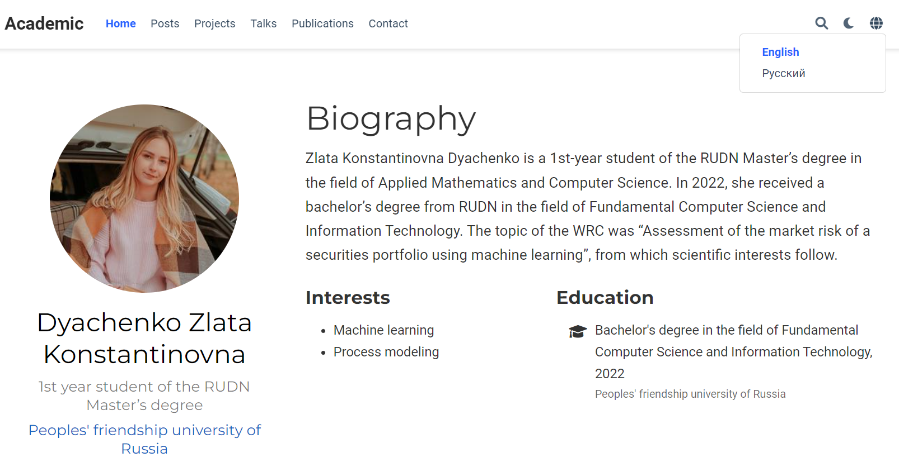
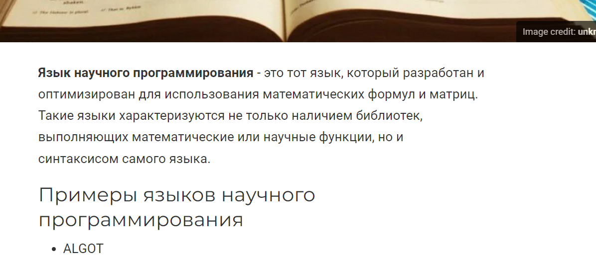

---
# Front matter
title: "Отчет по выполнению 5 этапа индивидуального проекта"
subtitle: "Дисциплина: Научное программирование"
author: "Выполнила Дяченко Злата Константиновна, НПМмд-02-22"

# Generic otions
lang: ru-RU
toc-title: "Содержание"

# Bibliography

# Pdf output format
toc: true # Table of contents
toc_depth: 2
lof: true # List of figures
lot: true # List of tables
fontsize: 12pt
linestretch: 1.5
papersize: a4
documentclass: scrreprt
## I18n
polyglossia-lang:
  name: russian
  options:
  - spelling=modern
  - babelshorthands=true
polyglossia-otherlangs:
  name: english
### Fonts
mainfont: PT Serif
romanfont: PT Serif
sansfont: PT Sans
monofont: PT Mono
mainfontoptions: Ligatures=TeX
romanfontoptions: Ligatures=TeX
sansfontoptions: Ligatures=TeX,Scale=MatchLowercase
monofontoptions: Scale=MatchLowercase,Scale=0.9
## Biblatex
biblatex: true
biblio-style: "gost-numeric"
biblatexoptions:
  - parentracker=true
  - backend=biber
  - hyperref=auto
  - language=auto
  - autolang=other*
  - citestyle=gost-numeric
## Misc options
indent: true
header-includes:
  - \linepenalty=10 # the penalty added to the badness of each line within a paragraph (no associated penalty node) Increasing the value makes tex try to have fewer lines in the paragraph.
  - \interlinepenalty=0 # value of the penalty (node) added after each line of a paragraph.
  - \hyphenpenalty=50 # the penalty for line breaking at an automatically inserted hyphen
  - \exhyphenpenalty=50 # the penalty for line breaking at an explicit hyphen
  - \binoppenalty=700 # the penalty for breaking a line at a binary operator
  - \relpenalty=500 # the penalty for breaking a line at a relation
  - \clubpenalty=150 # extra penalty for breaking after first line of a paragraph
  - \widowpenalty=150 # extra penalty for breaking before last line of a paragraph
  - \displaywidowpenalty=50 # extra penalty for breaking before last line before a display math
  - \brokenpenalty=100 # extra penalty for page breaking after a hyphenated line
  - \predisplaypenalty=10000 # penalty for breaking before a display
  - \postdisplaypenalty=0 # penalty for breaking after a display
  - \floatingpenalty = 20000 # penalty for splitting an insertion (can only be split footnote in standard LaTeX)
  - \raggedbottom # or \flushbottom
  - \usepackage{float} # keep figures where there are in the text
  - \floatplacement{figure}{H} # keep figures where there are in the text
---

# Цель работы

Размещение двуязычного сайта на Github.

# Задание

- Сделать поддержку английского и русского языков.
- Разместить элементы сайта на обоих языках.
- Разместить контент на обоих языках.
- Сделать пост по прошедшей неделе.
- Добавить пост на тему (на двух языках): Языки научного программирования.

# Выполнение пятого этапа проекта

## Шаг 1

Изменила содержание файла */blog/blog/config/_default/languages.yaml* для поддержки сайтом двух языков - русского и английского. Содержание файла показано на Рисунке 1 (рис. -@fig:001).

{#fig:001 width=70%}

## Шаг 2

Для размещения контента на двух языках создала папку *blog/blog/content/ru*, куда поместила все уже ранее имеющиеся файлы (так как они все на русском языке), и папку *blog/blog/content/en* (рис. -@fig:002), куда изначально скопировала все имеющиеся файлы.

{#fig:002 width=70%}

Далее работала с файлами в данной папке: перевела информацию о себе (рис. -@fig:003), достижениях (рис. -@fig:004) и все посты, ранее уже опубликованные.

{#fig:003 width=70%}

{#fig:004 width=70%}

На Рисунке 5 (рис. -@fig:005) показан переведенный старый пост.

{#fig:005 width=70%}

На Рисунке 6 (рис. -@fig:006) продемонстрирована поддержка двух языков. Теперь в правом верхнем углу возможен выбор языка. При выборе английского вся информация (и контент) отображаются на английском.

{#fig:006 width=70%}

## Шаг 3

Для создания поста на тему "Языки научного программирования" создала папку *blog/blog/content/ru/post/langsci* и *blog/blog/content/en/post/langsci*, а в них файлы *index.md*. Кроме того, добавила в папки сопровождающую картинку. Содержание файла *blog/blog/content/ru/post/report/index.md* представлено на Рисунке 7 (рис. -@fig:007). Пост был написан и для англоязычной версии сайта. Внешний вид части поста на сайте представлен на Рисунке 8 (рис. -@fig:008).

{#fig:007 width=70%}

{#fig:008 width=70%}

## Шаг 4

Аналогично был создан пост о прошедшей неделе на двух языках. Англоязычный пост на сайте представлен на Рисунке 9 (рис. -@fig:009).

{#fig:009 width=70%}

# Выводы

Я добавила на сайт поддержку английского и русского языков, разместила всю информацию и контент на двух языках а также написала два новых поста. Результаты работы видны [на сайте](https://zlatadyachenko.github.io/), а также есть [скринкаст выполнения лабораторной работы](https://www.youtube.com/watch?v=25-CuUcb7KA).
