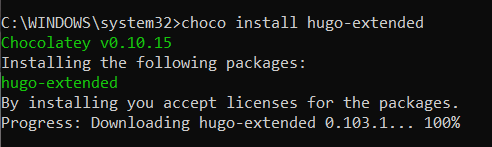
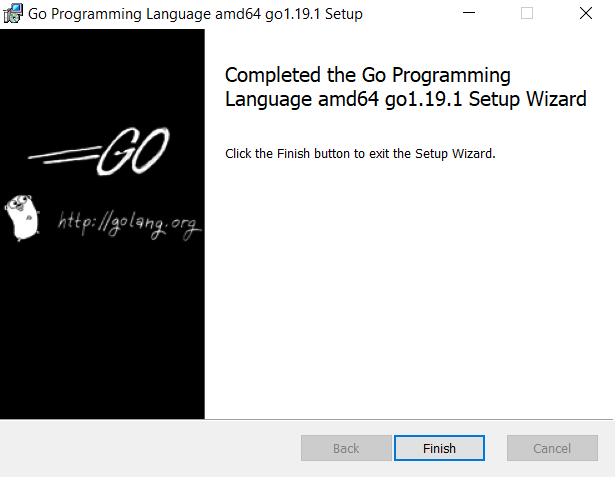
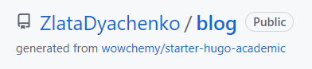
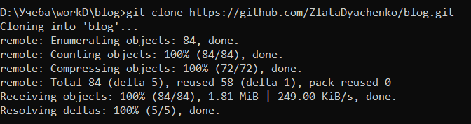
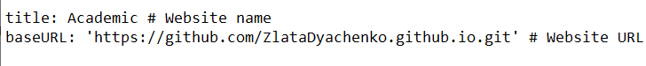
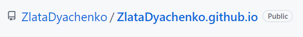
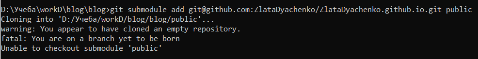
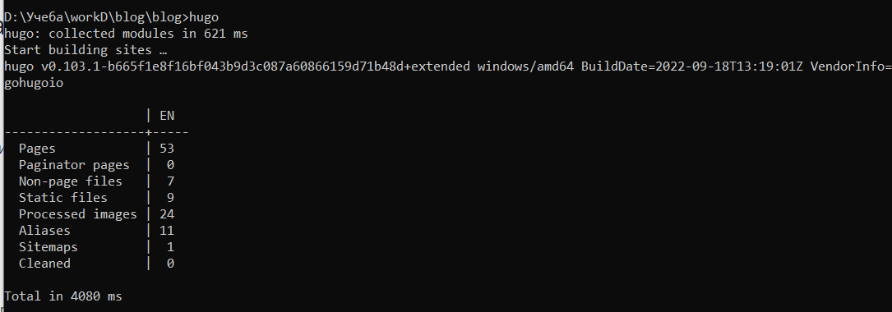
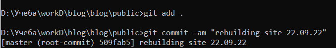
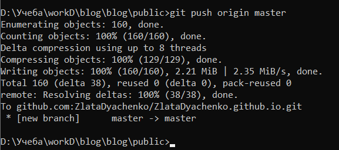

---
## Front matter
lang: ru-RU
title: "Отчет о выполнении 1 этапа индивидуального проекта"
subtitle: "Дисциплина: Научное программирование"
author:
  - Дяченко З. К.
institute:
  - Российский университет дружбы народов, Москва, Россия
date: 24 сентября 2022

## Formatting
toc: false
slide_level: 2
theme: metropolis
header-includes:
 - \metroset{progressbar=frametitle,sectionpage=progressbar,numbering=fraction}
 - '\makeatletter'
 - '\beamer@ignorenonframefalse'
 - '\makeatother'
aspectratio: 43
section-titles: true
---

## Прагматика выполнения работы

Данный проект выполняется мной для приобретения практических навыков и умений работы с Git pages и hugo.

## Цель выполнения работы

Размещение на Github pages заготовки для персонального сайта.

## Задачи выполнения работы

Установить необходимое программное обеспечение (рис. @fig:001 и рис. @fig:002).

{#fig:001 width=70%}

## Задачи выполнения работы

{#fig:002 width=70%}

## Задачи выполнения работы

Скачать шаблон темы сайта (рис. @fig:003 и рис. @fig:004).

{#fig:003 width=70%}

## Задачи выполнения работы

{#fig:004 width=70%}   

## Задачи выполнения работы

Установить параметр для URLs сайта (рис. @fig:005).   

{#fig:005 width=70%}

## Задачи выполнения работы

Разместить заготовку сайта на Github pages (рис. @fig:006 - @fig:010).

{#fig:006 width=70%}

## Задачи выполнения работы

{#fig:007 width=70%}

## Задачи выполнения работы

{#fig:008 width=70%}

## Задачи выполнения работы

{#fig:009 width=70%}

## Задачи выполнения работы

{#fig:010 width=70%}

## Результаты выполнения лабораторной работы

Результатом выполнения работы стала созданная заготовка сайта, размещенная на GitHub pages, что отражает проделанную мной работу и полученные новые знания.
