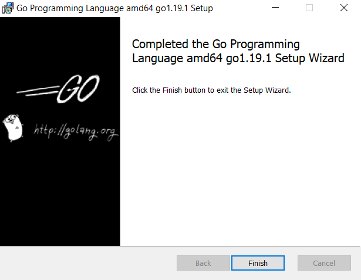
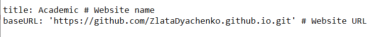
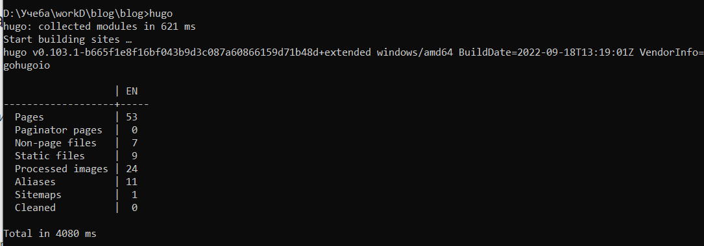

---
# Front matter
title: "Отчет по выполнению 1 этапа индивидуального проекта"
subtitle: "Дисциплина: Научное программирование"
author: "Выполнила Дяченко Злата Константиновна, НПМмд-02-22"

# Generic otions
lang: ru-RU
toc-title: "Содержание"

# Bibliography

# Pdf output format
toc: true # Table of contents
toc_depth: 2
lof: true # List of figures
lot: true # List of tables
fontsize: 12pt
linestretch: 1.5
papersize: a4
documentclass: scrreprt
## I18n
polyglossia-lang:
  name: russian
  options:
  - spelling=modern
  - babelshorthands=true
polyglossia-otherlangs:
  name: english
### Fonts
mainfont: PT Serif
romanfont: PT Serif
sansfont: PT Sans
monofont: PT Mono
mainfontoptions: Ligatures=TeX
romanfontoptions: Ligatures=TeX
sansfontoptions: Ligatures=TeX,Scale=MatchLowercase
monofontoptions: Scale=MatchLowercase,Scale=0.9
## Biblatex
biblatex: true
biblio-style: "gost-numeric"
biblatexoptions:
  - parentracker=true
  - backend=biber
  - hyperref=auto
  - language=auto
  - autolang=other*
  - citestyle=gost-numeric
## Misc options
indent: true
header-includes:
  - \linepenalty=10 # the penalty added to the badness of each line within a paragraph (no associated penalty node) Increasing the value makes tex try to have fewer lines in the paragraph.
  - \interlinepenalty=0 # value of the penalty (node) added after each line of a paragraph.
  - \hyphenpenalty=50 # the penalty for line breaking at an automatically inserted hyphen
  - \exhyphenpenalty=50 # the penalty for line breaking at an explicit hyphen
  - \binoppenalty=700 # the penalty for breaking a line at a binary operator
  - \relpenalty=500 # the penalty for breaking a line at a relation
  - \clubpenalty=150 # extra penalty for breaking after first line of a paragraph
  - \widowpenalty=150 # extra penalty for breaking before last line of a paragraph
  - \displaywidowpenalty=50 # extra penalty for breaking before last line before a display math
  - \brokenpenalty=100 # extra penalty for page breaking after a hyphenated line
  - \predisplaypenalty=10000 # penalty for breaking before a display
  - \postdisplaypenalty=0 # penalty for breaking after a display
  - \floatingpenalty = 20000 # penalty for splitting an insertion (can only be split footnote in standard LaTeX)
  - \raggedbottom # or \flushbottom
  - \usepackage{float} # keep figures where there are in the text
  - \floatplacement{figure}{H} # keep figures where there are in the text
---

# Цель работы

Размещение на Github pages заготовки для персонального сайта.

# Задание

— Установить необходимое программное обеспечение.   
— Скачать шаблон темы сайта.   
— Разместить его на хостинге git.   
— Установить параметр для URLs сайта.   
— Разместить заготовку сайта на Github pages.   

# Выполнение первого этапа проекта

## Шаг 1

Установила hugo с помощью команды, представленной на Рисунке 1 (рис. -@fig:001), и язык GO (см. (рис. -@fig:002)).

{#fig:001 width=70%}

{#fig:002 width=70%}

## Шаг 2

Скопировала шаблон темы сайта в репозиторий, показанный на Рисунке 3 (рис. -@fig:003).

{#fig:003 width=70%}

Затем скопировала файлы в локальный каталог с помощью команды, показанной на Рисунке 4 (рис. -@fig:004).

{#fig:004 width=70%}

## Шаг 3

Удалила файл *demo.md*, который отвечал за показ демо виджета на сайте, что подтверждает Рисунок 5 (рис. -@fig:005).

{#fig:005 width=70%}

## Шаг 4

Создала репозиторий с именем, показанным на Рисунке 6 (рис. -@fig:006).

{#fig:006 width=70%}

Затем создала подмодуль public в папке блога, используя команду, показанную на Рисунке 7 (рис. -@fig:007).

{#fig:007 width=70%}

В файле *config.yaml* изменила baseURL, как показано на Рисунке 8 (рис. -@fig:008).

{#fig:008 width=70%}

Сгенерировала проект (см. (рис. -@fig:009)), зафиксировала изменения и отправила контент на GitHub (см. (рис. -@fig:010) и (рис. -@fig:011))

{#fig:009 width=70%}

{#fig:010 width=70%}

{#fig:011 width=70%}

# Выводы

Я установила hugo и go и, используя шаблон темы сайта, разместила на Github pages заготовки для персонального сайта. Результаты работы находятся в [репозитории на GitHub](https://github.com/ZlataDyachenko/workD), а также есть [скринкаст выполнения лабораторной работы](https://www.youtube.com/watch?v=z_-LjSAWPts).
