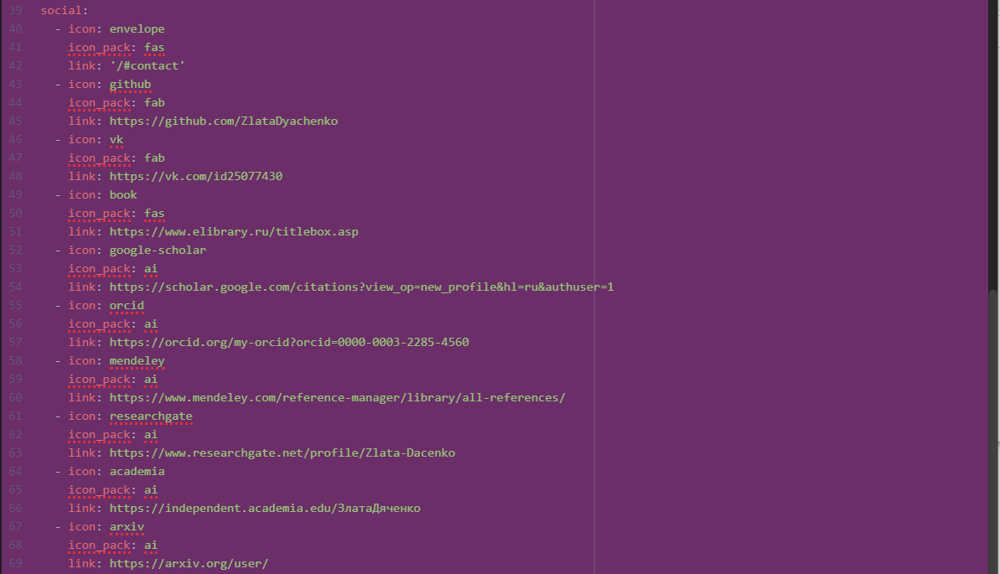
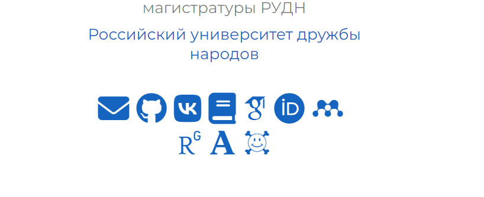
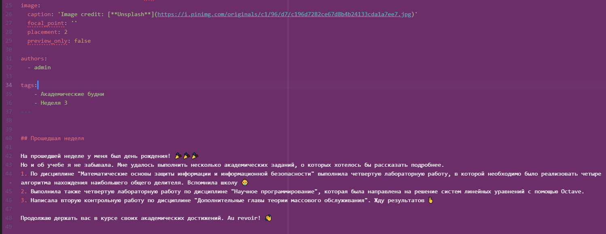
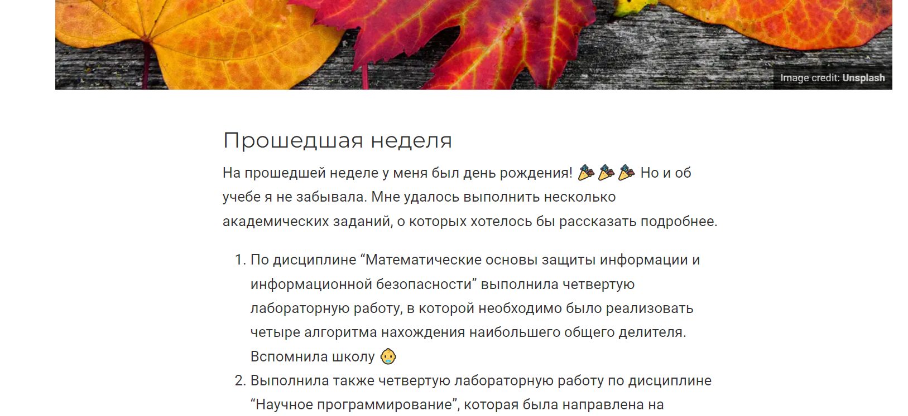
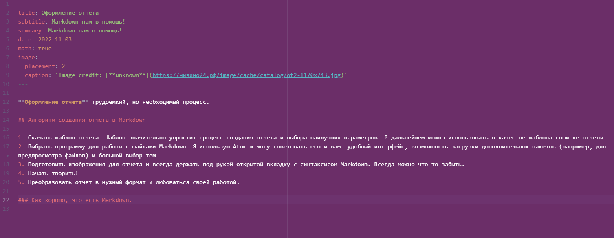
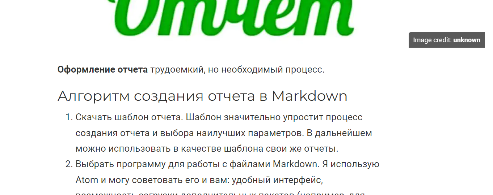

---
# Front matter
title: "Отчет по выполнению 4 этапа индивидуального проекта"
subtitle: "Дисциплина: Научное программирование"
author: "Выполнила Дяченко Злата Константиновна, НПМмд-02-22"

# Generic otions
lang: ru-RU
toc-title: "Содержание"

# Bibliography

# Pdf output format
toc: true # Table of contents
toc_depth: 2
lof: true # List of figures
lot: true # List of tables
fontsize: 12pt
linestretch: 1.5
papersize: a4
documentclass: scrreprt
## I18n
polyglossia-lang:
  name: russian
  options:
  - spelling=modern
  - babelshorthands=true
polyglossia-otherlangs:
  name: english
### Fonts
mainfont: PT Serif
romanfont: PT Serif
sansfont: PT Sans
monofont: PT Mono
mainfontoptions: Ligatures=TeX
romanfontoptions: Ligatures=TeX
sansfontoptions: Ligatures=TeX,Scale=MatchLowercase
monofontoptions: Scale=MatchLowercase,Scale=0.9
## Biblatex
biblatex: true
biblio-style: "gost-numeric"
biblatexoptions:
  - parentracker=true
  - backend=biber
  - hyperref=auto
  - language=auto
  - autolang=other*
  - citestyle=gost-numeric
## Misc options
indent: true
header-includes:
  - \linepenalty=10 # the penalty added to the badness of each line within a paragraph (no associated penalty node) Increasing the value makes tex try to have fewer lines in the paragraph.
  - \interlinepenalty=0 # value of the penalty (node) added after each line of a paragraph.
  - \hyphenpenalty=50 # the penalty for line breaking at an automatically inserted hyphen
  - \exhyphenpenalty=50 # the penalty for line breaking at an explicit hyphen
  - \binoppenalty=700 # the penalty for breaking a line at a binary operator
  - \relpenalty=500 # the penalty for breaking a line at a relation
  - \clubpenalty=150 # extra penalty for breaking after first line of a paragraph
  - \widowpenalty=150 # extra penalty for breaking before last line of a paragraph
  - \displaywidowpenalty=50 # extra penalty for breaking before last line before a display math
  - \brokenpenalty=100 # extra penalty for page breaking after a hyphenated line
  - \predisplaypenalty=10000 # penalty for breaking before a display
  - \postdisplaypenalty=0 # penalty for breaking after a display
  - \floatingpenalty = 20000 # penalty for splitting an insertion (can only be split footnote in standard LaTeX)
  - \raggedbottom # or \flushbottom
  - \usepackage{float} # keep figures where there are in the text
  - \floatplacement{figure}{H} # keep figures where there are in the text
---

# Цель работы

Добавить к сайту ссылки на научные и библиометрические ресурсы.

# Задание

- Зарегистрироваться на соответствующих ресурсах и разместить на них ссылки на сайте:
    * eLibrary : https://elibrary.ru/;
    * Google Scholar : https://scholar.google.com/;
    * ORCID : https://orcid.org/;
    * Mendeley : https://www.mendeley.com/;
    * ResearchGate : https://www.researchgate.net/;
    * Academia.edu : https://www.academia.edu/;
    * arXiv : https://arxiv.org/;
    * github : https://github.com/.
- Сделать пост по прошедшей неделе.
- Добавить пост на тему по выбору:
    * Оформление отчета.
    * Создание презентаций.
    * Работа с библиографией.

# Выполнение четвертого этапа проекта

## Шаг 1

Зарегистрировалась на всех указанных в задании ресурсах. Добавить на них ссылки на сайте решила в раздел social, который отображается под главной фотографией. Для этого добавила необходимые иконки и ссылки в файле */blog/blog/content/authors/admin/_index.md*, что показано на Рисунке 1 (рис. -@fig:001). Вид данного раздела на сайте представлен на Рисунке 2 (рис. -@fig:002).

{#fig:001 width=70%}

{#fig:002 width=70%}

## Шаг 4

Для создания поста о прошедшей неделе создала папку *blog/blog/content/post/week3*, а в ней файл *index.md*. Кроме того, добавила в папку сопровождающую картинку. Часть файла *blog/blog/content/post/week3/index.md* представлена на Рисунке 3 (рис. -@fig:003). Внешний вид части поста на сайте представлен на Рисунке 4 (рис. -@fig:004).

{#fig:003 width=70%}

{#fig:004 width=70%}

## Шаг 5

Для создания поста на тему "Оформление отчета" создала папку *blog/blog/content/post/report*, а в ней файл *index.md*. Кроме того, добавила в папку сопровождающую картинку. Содержание файла *blog/blog/content/post/report/index.md* представлено на Рисунке 5 (рис. -@fig:005). Внешний вид части поста на сайте представлен на Рисунке 6 (рис. -@fig:006).

{#fig:005 width=70%}

{#fig:006 width=70%}

# Выводы

Я добавила на сайт ссылки на научные и библиометрические ресурсы, а также написала два новых поста. Результаты работы видны [на сайте](https://zlatadyachenko.github.io/), а также есть [скринкаст выполнения лабораторной работы](https://www.youtube.com/watch?v=7JKUF0VdgKc).
